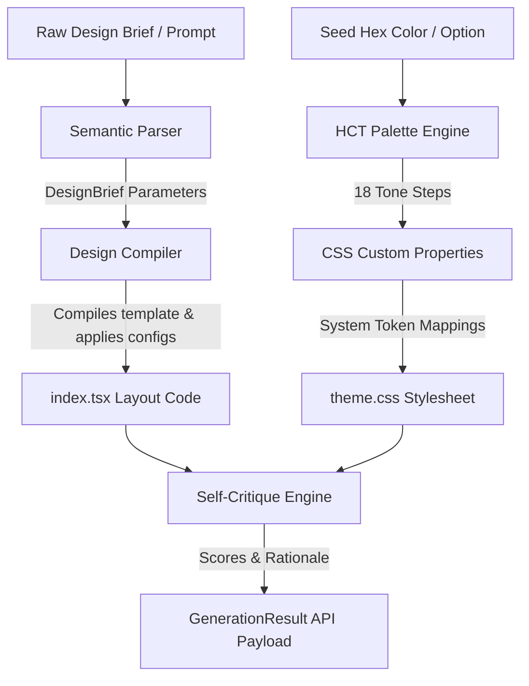

# @aphrody/design

`@aphrody/design` is a high-performance design compiler and prompt processing engine. It compiles raw natural-language design briefs directly into **Material Design 3 (M3)** and **Google Design** compatible visual structures, outputting production-ready React 19 / Lit layout trees and tonal-palette style sheets.

Designed to serve as a fast design compiler for autonomous agents, it replaces manual visual configuration forms with a **Zero-Click semantic parser** and a **HCT-inspired tonal theme compiler**.

---

## Architecture Overview

The package is split into four decoupled components that translate text specs into running code:



### 1. Semantic Parser (`src/parser.ts`)

Bypasses manual questionnaire inputs by parsing raw natural language prompts. It extracts structural parameters, including:

- **Output Kind**: Categorizes target layout modes (`deck`, `prototype`, `dashboard`, `mobile`, `editorial`).
- **Adaptive Platform**: Identifies target device viewports (`desktop-web`, `ios`, `responsive-web`).
- **Layout Organization**: Maps structural constraints to layout models (`scaffold`, `list-detail`, `supporting-pane`, `feed`).
- **Visual Density**: Standardizes layout spacing (`high` compact, `default`, `low` loose spacing).
- **Color Extraction**: Detects hex patterns or references to colors (e.g. "sombre bleu", "compact rouge") to select seed colors.
- **Feature Toggles**: Auto-detects real-time streaming, thinking/shimmer indicators, and Wiz action routing constraints.

### 2. HCT Theme Compiler (`src/hct.ts`)

Implements an approximation of Google's **HCT (Hue, Chroma, Tone)** color space using dynamic HSL transformations:

- **Sine Saturation Tuning**: Automatically drops saturation close to tone boundaries (Tone 0 and Tone 100) to match real perceptual curves.
- **Tonal Palettes**: Computes 18 tone steps `[0, 6, 10, 12, 20, 22, 30, 40, 50, 60, 70, 80, 90, 94, 95, 98, 99, 100]` across 6 core keys: `primary`, `secondary`, `tertiary`, `error`, `neutral`, and `neutral-variant`.
- **CSS Compilation**: Automatically maps palettes to M3 light and dark mode custom system tokens (e.g., `--md-sys-color-primary-container`, `--md-sys-color-surface-container`).

### 3. Layout Generator (`src/generator.ts`)

The core code generation engine. It processes the parsed `DesignBrief` and compiles the `SEED_TEMPLATE` code tree:

- **Layout Adapters**: Mutates scaffolding layout structures (e.g. automatically strips navigation rails and injects bottom app bars for mobile targets; restructures list item mappings into slide sequences for deck outputs).
- **Environment Injectors**: Injects dark mode classes (`bg-neutral-900` / `text-neutral-100`) and desaturates colors for additive environments (such as translucent AR/XR overlays).
- **Self-Critique Engine**: Conducts static analysis on the output artifact, grading it against M3 guidelines across 5 axes: `philosophy`, `hierarchy`, `detail`, `functionalParity`, and `innovation`.

### 4. Server/CLI Daemon (`src/server.ts`)

Exposes the compiler via a fast REST API server and a direct terminal CLI wrapper powered by the Bun runtime.

---

## Getting Started

> [!NOTE]
> All tasks are run from the workspace root or inside the `apps/design/` directory.

### Running via CLI

Generate design specs and layouts directly to standard output:

```bash
# Run from workspace root:
bun apps/design/src/server.ts --prompt "Fais un deck sombre compact en bleu" --color "#0F52BA"
```

### Starting the HTTP Server

Launch the HTTP service daemon (binds to port `3005` by default):

```bash
bun apps/design/src/server.ts
```

---

## REST API Specification

### Generate Layout and Palette

- **Endpoint**: `POST /api/generate`
- **Content-Type**: `application/json`

#### Request Payload

| Field       | Type     | Required | Description                                                   |
| :---------- | :------- | :------- | :------------------------------------------------------------ |
| `prompt`    | `string` | **Yes**  | Natural language text defining design layout requirements.    |
| `seedColor` | `string` | No       | Hex string (e.g., `#CE422B`) to seed the HCT tonal generator. |

#### Response Schema (`GenerationResult`)

```json
{
  "brief": {
    "outputKind": "deck",
    "platforms": ["desktop-web"],
    "audience": "general users",
    "tones": ["minimal"],
    "seedColor": "#0F52BA",
    "scale": "8 slides",
    "constraints": "Dark mode first",
    "rawBrief": "Fais un deck sombre compact en bleu",
    "layoutType": "scaffold",
    "density": "high",
    "hasThinkingIndicator": false,
    "hasStreaming": false,
    "hasWizDelegation": false
  },
  "theme": {
    "seed": "#0F52BA",
    "palettes": {
      "primary": { "name": "primary", "tones": { "0": "#000000", "40": "#0A3B85", ... } },
      ...
    },
    "cssCustomProperties": ":root {\n  --md-ref-palette-primary-0: #000000; ..."
  },
  "files": [
    { "path": "src/theme.css", "content": "..." },
    { "path": "src/index.tsx", "content": "..." }
  ],
  "critique": {
    "scores": {
      "philosophy": 90,
      "hierarchy": 92,
      "detail": 95,
      "functionalParity": 98,
      "innovation": 94
    },
    "rationale": "M3 design compiler successfully mapped the brief..."
  }
}
```

---

## Mapped Component Catalog

The layout generator is pre-configured with a catalog of **61 components** imported from `@aphrody-code/m3-react`.

| Category           | Component Name       | Custom Element              | Key Properties & Specs                                           |
| :----------------- | :------------------- | :-------------------------- | :--------------------------------------------------------------- |
| **Action**         | `ElevatedButton`     | `<md-elevated-button>`      | High emphasis button with elevation shadows.                     |
|                    | `FilledButton`       | `<md-filled-button>`        | Primary visual trigger, solid color container.                   |
|                    | `FilledTonalButton`  | `<md-filled-tonal-button>`  | Secondary trigger, tonal container coloring.                     |
|                    | `OutlinedButton`     | `<md-outlined-button>`      | Medium emphasis button, outline border.                          |
|                    | `TextButton`         | `<md-text-button>`          | Low emphasis text-only button.                                   |
|                    | `IconButton`         | `<md-icon-button>`          | Low emphasis icon interactive trigger.                           |
|                    | `FilledIconButton`   | `<md-filled-icon-button>`   | Solid container icon button.                                     |
|                    | `Fab`                | `<md-fab>`                  | Floating action button (`label`, `icon`).                        |
|                    | `BrandedFab`         | `<md-branded-fab>`          | Floating action button with custom brand visual.                 |
|                    | `FabMenu`            | `<md-fab-menu>`             | Wrapper container for floating action menus.                     |
|                    | `FabMenuItem`        | `<md-fab-menu-item>`        | Interactive menu option within a floating action menu.           |
|                    | `ButtonGroup`        | `<md-button-group>`         | Button grouping container.                                       |
| **Forms & Select** | `Checkbox`           | `<md-checkbox>`             | State change control; touch target >= 48dp.                      |
|                    | `Radio`              | `<md-radio>`                | Mutually exclusive radio option controls.                        |
|                    | `Switch`             | `<md-switch>`               | High-visibility binary layout configuration toggle.              |
|                    | `Slider`             | `<md-slider>`               | Continuous or discrete range sliders.                            |
|                    | `AssistChip`         | `<md-assist-chip>`          | Non-dismissible chips that trigger action assists.               |
|                    | `FilterChip`         | `<md-filter-chip>`          | Multi-selection state chip toggles.                              |
|                    | `InputChip`          | `<md-input-chip>`           | Removable chips representing user input.                         |
|                    | `SuggestionChip`     | `<md-suggestion-chip>`      | Fast suggestion response helpers.                                |
|                    | `ChipSet`            | `<md-chip-set>`             | Grid grouping for chips.                                         |
| **Inputs**         | `FilledTextField`    | `<md-filled-text-field>`    | Container text input. Handles multi-line with `type="textarea"`. |
|                    | `OutlinedTextField`  | `<md-outlined-text-field>`  | Bordered text inputs.                                            |
| **Communication**  | `Dialog`             | `<md-dialog>`               | Modal alerts. Exposes custom slots `content` and `actions`.      |
|                    | `CircularProgress`   | `<md-circular-progress>`    | Spinner indicator (handles custom `value` or `indeterminate`).   |
|                    | `LinearProgress`     | `<md-linear-progress>`      | Standard progress indicators.                                    |
|                    | `Snackbar`           | `<md-snackbar>`             | Toast-style overlay notifications.                               |
|                    | `LoadingIndicator`   | `<md-loading-indicator>`    | Custom shimmer and loading spinner indicators.                   |
| **Navigation**     | `Tabs`               | `<md-tabs>`                 | Header selection row.                                            |
|                    | `PrimaryTab`         | `<md-primary-tab>`          | Primary tab visual structure with underline.                     |
|                    | `SecondaryTab`       | `<md-secondary-tab>`        | Secondary tab visual structure.                                  |
|                    | `Menu`               | `<md-menu>`                 | Context list menus.                                              |
|                    | `MenuItem`           | `<md-menu-item>`            | Interactive list item within menus.                              |
|                    | `NavigationRail`     | `<md-navigation-rail>`      | Vertical rail for desktop layouts.                               |
|                    | `NavigationRailItem` | `<md-navigation-rail-item>` | Rail nav item.                                                   |
|                    | `TopAppBar`          | `<md-top-app-bar>`          | Sticky header toolbar.                                           |
|                    | `BottomAppBar`       | `<md-bottom-app-bar>`       | Mobile-focused command footer bar.                               |
|                    | `SearchBar`          | `<md-search-bar>`           | Native search header.                                            |
|                    | `Toolbar`            | `<md-toolbar>`              | Action button row.                                               |
| **Containment**    | `List`               | `<md-list>`                 | Container grouping multiple vertical elements.                   |
|                    | `ListItem`           | `<md-list-item>`            | List entry supporting `headline` and `supportingText`.           |
|                    | `Divider`            | `<md-divider>`              | Horizontal separator line rules.                                 |
| **Layout Panes**   | `Scaffold`           | `<md-scaffold>`             | Main layout viewport controller.                                 |
|                    | `Pane`               | `<md-pane>`                 | Independent side columns or panels.                              |
|                    | `ListDetail`         | `<md-list-detail>`          | Side-by-side list and detail screens.                            |
|                    | `SupportingPane`     | `<md-supporting-pane>`      | Focus layout columns with supporting side margins.               |
| **Enterprise**     | `Tooltip`            | `<md-tooltip>`              | Context overlays triggered by user hovering.                     |
|                    | `ExpansionPanel`     | `<md-expansion-panel>`      | Dropdown accordions.                                             |
|                    | `Accordion`          | `<md-accordion>`            | Grouped expansion panel headers.                                 |
|                    | `GridList`           | `<md-grid-list>`            | Image and card collection layout grids.                          |
|                    | `GridTile`           | `<md-grid-tile>`            | Interactive items inside grids.                                  |
|                    | `Table`              | `<md-table>`                | Structured data layouts.                                         |
|                    | `Paginator`          | `<md-paginator>`            | Data table paging interfaces.                                    |
|                    | `VirtualScroller`    | `<md-virtual-scroller>`     | High performance list viewport rendering.                        |
|                    | `Stepper`            | `<md-stepper>`              | Sequential task guide structures.                                |
|                    | `Step`               | `<md-step>`                 | Individual steps in step flow containers.                        |
|                    | `Autocomplete`       | `<md-autocomplete>`         | Dynamic selection input field.                                   |
|                    | `Tree`               | `<md-tree>`                 | Multi-level hierarchy nodes.                                     |
|                    | `TreeItem`           | `<md-tree-item>`            | Interactive tree nodes.                                          |
| **Typography**     | `TypeText`           | `<md-type>`                 | Variable typography elements using optical sizes.                |
|                    | `WebgpuCanvas`       | `<md-webgpu-canvas>`        | GPU-backed particle or gradient canvas animations.               |

---

## Physical Motion Presets

In alignment with **Google Design Guidelines**, transition timings enforce standard mechanical spring profiles via CSS cubic-bezier parameters.

```
       STIFFNESS & OVERSHOOT BEHAVIOR

  Damping 0.9 (Spatial)      Damping 1.0 (Effects)

       /\                         /‾‾‾‾‾‾‾‾‾
      /  \                       /
     /    \                     /
    /      \                   /
  ‾‾        \________        ‾‾
```

> [!IMPORTANT]
> Always match the correct preset mode based on the visual property being animated.

- **Spatial Animations**: Used for components moving across dimensions (e.g. expanding sidebar, dragging sliders, dialog scales).
- **Effects Animations**: Used for opacity shifts and background color state changes (e.g. hover shadows, active state highlights, fade effects).

### Spring Presets Specification Table

| Preset Name         | Damping Ratio | Cubic Bezier Curve                     | Target Duration | Common Uses                   |
| :------------------ | :------------ | :------------------------------------- | :-------------- | :---------------------------- |
| **Fast Spatial**    | `0.9`         | `cubic-bezier(0.42, 1.67, 0.21, 0.90)` | `350 ms`        | Slide panels, quick lists.    |
| **Default Spatial** | `0.9`         | `cubic-bezier(0.38, 1.21, 0.22, 1.00)` | `500 ms`        | Modal dialog openings, rails. |
| **Fast Effects**    | `1.0`         | `cubic-bezier(0.31, 0.94, 0.34, 1.00)` | `150 ms`        | Opacity fades, hover changes. |
| **Default Effects** | `1.0`         | `cubic-bezier(0.34, 0.80, 0.34, 1.00)` | `200 ms`        | Color updates, page loads.    |

---

## Wiz Event Delegation Routing

The generated code leverages a **centralized event delegation pattern** inspired by Google's Wiz framework to optimize performance and prevent event listener pollution.

Rather than binding distinct `onClick` listeners to hundreds of separate elements, a single event router listens at the root viewport boundary and forwards interactions using `data-action` and `data-id` properties.

> [!TIP]
> Use this routing model to dramatically lower memory footprints and eliminate component re-renders during interactions.

```tsx
export default function GeneratedArtifact() {
  // Central Event Router
  const handleInteraction = (e: React.MouseEvent<HTMLDivElement>) => {
    const actionElement = (e.target as HTMLElement).closest('[data-action]');
    if (!actionElement) return;

    const action = actionElement.getAttribute('data-action');
    const id = actionElement.getAttribute('data-id');

    // Action-specific routing mappings
    switch (action) {
      case 'toggle-dialog':
        const dialog = document.querySelector('md-dialog');
        if (dialog) (dialog as any).open = !(dialog as any).open;
        break;
      case 'select-item':
        console.log(`Routing item selection to handler ID: ${id}`);
        break;
      default:
        console.log(`Delegated interaction: ${action} on ID ${id}`);
    }
  };

  return (
    <div onClick={handleInteraction} className="min-h-screen bg-background">
      <TopAppBar>
        <ElevatedButton data-action="toggle-dialog" data-id="main-spec-modal">
          Show Specs
        </ElevatedButton>
      </TopAppBar>

      <List>
        <ListItem
          headline="Spring Config"
          data-action="select-item"
          data-id="spring-item"
        />
      </List>
    </div>
  );
}
```

---

## Workspace Specifications

All modules are structured as clean, type-safe ESM exports:

- `src/types.ts`: Core models (`DesignBrief`, `M3Theme`, `GeneratedFile`, `GenerationResult`).
- `src/parser.ts`: Natural-language prompt parsing module.
- `src/hct.ts`: approximation algorithm for Material tonal palettes.
- `src/prompts.ts`: Directives mapping, systemic templates, and visual catalogs.
- `src/generator.ts`: Main layout compiler logic.
- `src/server.ts`: HTTP Server and command-line execution framework.
