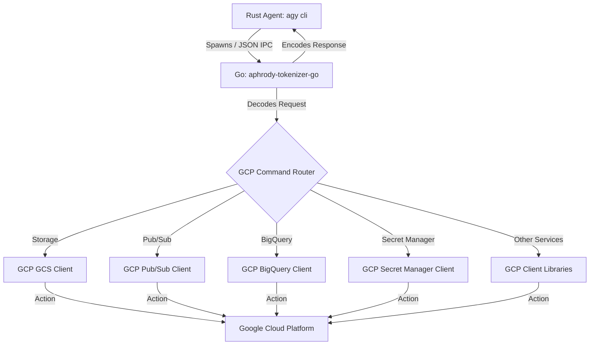

<!-- SPDX-License-Identifier: Apache-2.0 -->
<!-- SPDX-FileCopyrightText: 2026 aphrody contributors -->

# Integration Plan: Exposing Google Cloud APIs in `aphrody-tokenizer-go`

This document details the mapping of key Google Cloud Platform (GCP) Go client libraries and drafts the implementation plan to expose their capabilities inside the unified Go companion tool (`aphrody-tokenizer-go`). This allows the core Rust agent (`agy cli`) to consume them seamlessly via standard JSON IPC or CLI subcommands.

---

## 1. Architectural Design Overview

The unified companion tool (`aphrody-tokenizer-go`) operates as a subprocess spawned by the core Rust agent. They communicate via standard input (`stdin`) and standard output (`stdout`) using a line-oriented or single-shot JSON IPC exchange.



To integrate Google Cloud APIs, we will:
1. **Extend Request/Response Schemas**: Add request parameters and response fields to the existing `Request` and `Response` structs in `gogcli/cmd/aphrody-tokenizer-go/main.go`.
2. **Implement Subcommand Dispatching**: Extend both the CLI argument parser and the JSON IPC decoder to route commands to specialized handler functions.
3. **Integrate Official Go Client Libraries**: Add the necessary `cloud.google.com/go/...` packages as dependencies in `go.mod` and write idiomatic, high-performance wrapper functions.

---

## 2. Google Cloud Go API Client Mapping

Below is the mapping of official Google Cloud Go client libraries that will be exposed in the tool:

| GCP Service | Official Go Module / Package Path | Key Client Struct | Core Capabilities |
| :--- | :--- | :--- | :--- |
| **Cloud Storage (GCS)** | `cloud.google.com/go/storage` | `*storage.Client` | File upload/download, bucket operations, object metadata management, signed URLs. |
| **Pub/Sub** | `cloud.google.com/go/pubsub` | `*pubsub.Client` | Topic publishing, synchronous/asynchronous subscription pulling, message acknowledgement. |
| **BigQuery** | `cloud.google.com/go/bigquery` | `*bigquery.Client` | Query execution, streaming insertions, dataset and table metadata management. |
| **Secret Manager** | `cloud.google.com/go/secretmanager/apiv1` | `*secretmanager.Client` | Secret creation, adding secret versions, retrieving/accessing secret payloads. |
| **Firestore** | `cloud.google.com/go/firestore` | `*firestore.Client` | Document CRUD, complex collection queries, transactional writes, batch operations. |
| **Spanner** | `cloud.google.com/go/spanner` | `*spanner.Client` | Highly-consistent globally-distributed transactions, SQL query execution, mutation writes. |
| **KMS** | `cloud.google.com/go/kms/apiv1` | `*kms.KeyManagementClient` | Cryptographic encryption/decryption, asymmetric message signing, key ring management. |
| **Cloud Tasks** | `cloud.google.com/go/cloudtasks/apiv2` | `*cloudtasks.Client` | Task queue creation, creating/scheduling tasks for asynchronous execution. |
| **Translation** | `cloud.google.com/go/translate/apiv3` | `*translate.TranslationClient` | Text translation, language detection, glossary management. |
| **Speech-to-Text** | `cloud.google.com/go/speech/apiv2` | `*speech.Client` | Synchronous/asynchronous audio transcription, gRPC bidirectional streaming recognition. |
| **Vision** | `cloud.google.com/go/vision/v2/apiv1` | `*vision.ImageAnnotatorClient` | OCR text extraction, label detection, face analysis, safe-search content moderation. |
| **Vertex AI (Admin/Pipelines)** | `cloud.google.com/go/aiplatform/apiv1` | `*aiplatform.Client` | Direct metadata and pipeline control (Gemini is handled via `google.golang.org/genai`). |
| **Cloud Logging** | `cloud.google.com/go/logging` | `*logging.Client` | Structured log writing, logging filters, error reporting integration. |

---

## 3. IPC Schema Extensions (JSON Contracts)

The JSON request payload contains a `command` field to route execution. Below are the specific IPC contracts planned for each service:

### 3.1 Google Cloud Storage (GCS)
Allows copying files and raw data payloads to and from GCS buckets.

* **Upload Object (`gcs_upload`)**:
  * Request:
    ```json
    {
      "command": "gcs_upload",
      "bucket": "my-bucket",
      "object": "models/data.json",
      "local_file": "/tmp/local_file.json",
      "content": "raw file string content (if local_file omitted)",
      "content_type": "application/json"
    }
    ```
  * Response:
    ```json
    {
      "uri": "gs://my-bucket/models/data.json",
      "size_bytes": 124500,
      "md5": "a1b2c3d4...",
      "updated": "2026-05-23T05:14:00Z"
    }
    ```

* **Download Object (`gcs_download`)**:
  * Request:
    ```json
    {
      "command": "gcs_download",
      "bucket": "my-bucket",
      "object": "models/data.json",
      "local_file": "/tmp/downloaded.json"
    }
    ```
  * Response:
    ```json
    {
      "local_file": "/tmp/downloaded.json",
      "size_bytes": 124500
    }
    ```

### 3.2 Pub/Sub
Provides messaging queues for event ingestion and agent-to-agent coordination.

* **Publish Message (`pubsub_publish`)**:
  * Request:
    ```json
    {
      "command": "pubsub_publish",
      "project_id": "my-gcp-project",
      "topic": "agent-events",
      "text": "Message data payload",
      "attributes": {
        "source": "agy-cli",
        "priority": "high"
      }
    }
    ```
  * Response:
    ```json
    {
      "message_id": "11985472895"
    }
    ```

* **Pull Messages (`pubsub_pull`)**:
  * Request:
    ```json
    {
      "command": "pubsub_pull",
      "project_id": "my-gcp-project",
      "subscription": "agent-sub",
      "max_messages": 5
    }
    ```
  * Response:
    ```json
    {
      "messages": [
        {
          "message_id": "11985472895",
          "data": "Message data payload",
          "attributes": {
            "source": "agy-cli",
            "priority": "high"
          },
          "publish_time": "2026-05-23T05:14:00Z"
        }
      ]
    }
    ```

### 3.3 BigQuery
Allows executing data analysis queries and writing telemetry metrics directly.

* **Execute SQL Query (`bq_query`)**:
  * Request:
    ```json
    {
      "command": "bq_query",
      "project_id": "my-gcp-project",
      "prompt": "SELECT user_id, action FROM `my-project.logs.agent_actions` LIMIT 2"
    }
    ```
  * Response:
    ```json
    {
      "text": "JSON-encoded query results array",
      "total_rows": 2
    }
    ```

### 3.4 Secret Manager
Provides safe retrieval of API keys and server passwords.

* **Access Secret Version (`secret_get`)**:
  * Request:
    ```json
    {
      "command": "secret_get",
      "project_id": "my-gcp-project",
      "name": "huggingface-api-token",
      "expire_time": "latest" 
    }
    ```
  * Response:
    ```json
    {
      "text": "hf_A1B2C3D4E5F6..."
    }
    ```

---

## 4. Implementation Steps

### Phase 1: Dependency Management
Update `C:\src\aphrody-go\gogcli\go.mod` to pull the required GCP SDK modules:
```bash
cd C:\src\aphrody-go\gogcli
go get cloud.google.com/go/storage
go get cloud.google.com/go/pubsub
go get cloud.google.com/go/bigquery
go get cloud.google.com/go/secretmanager/apiv1
go get cloud.google.com/go/firestore
go get cloud.google.com/go/kms/apiv1
go get cloud.google.com/go/cloudtasks/apiv2
go get cloud.google.com/go/translate/apiv3
go get cloud.google.com/go/speech/apiv2
go get cloud.google.com/go/vision/v2/apiv1
```

### Phase 2: Schema Extensions in Go
Add the required variables to `Request` and `Response` structs in `main.go`:
```go
// Extended Request Struct
type Request struct {
    Command       string            `json:"command,omitempty"`
    ProjectID     string            `json:"project_id,omitempty"`
    Bucket        string            `json:"bucket,omitempty"`
    Object        string            `json:"object,omitempty"`
    Topic         string            `json:"topic,omitempty"`
    Subscription  string            `json:"subscription,omitempty"`
    MaxMessages   int               `json:"max_messages,omitempty"`
    Attributes    map[string]string `json:"attributes,omitempty"`
    // Existing fields...
}
```

### Phase 3: Handlers Implementation
Create a new file `gogcli/cmd/aphrody-tokenizer-go/gcp_handlers.go` containing service-specific wrapper logic, cleanly separating Workspace and GCP logic:
```go
package main

import (
    "context"
    "cloud.google.com/go/storage"
    "cloud.google.com/go/secretmanager/apiv1"
    secretmanagerpb "google.golang.org/genproto/googleapis/cloud/secretmanager/v1"
)

func runGCSUpload(ctx context.Context, req Request) (Response, error) {
    client, err := storage.NewClient(ctx)
    if err != nil {
         return Response{}, err
    }
    defer client.Close()
    
    // Upload logic here...
    return Response{URI: "gs://" + req.Bucket + "/" + req.Object}, nil
}
```

### Phase 4: Stdin Routing Integration
Hook these subcommands into the JSON-stdin parser loop in `main.go`:
```go
if req.Command == "gcs_upload" {
    resp, err := runGCSUpload(ctx, req)
    if err != nil {
        writeJSONError(err.Error())
        os.Exit(1)
    }
    json.NewEncoder(os.Stdout).Encode(resp)
    os.Exit(0)
}
```

---

## 5. Authentication & Security Best Practices

1. **Application Default Credentials (ADC)**: The companion app relies primarily on GCP ADC. Running in GCE, GKE, or Cloud Run resolves auth automatically. Locally, developers run:
   ```bash
   gcloud auth application-default login
   ```
2. **Explicit Credential Paths**: To enforce sandbox execution or specific service account execution, the `Request` payload can carry an optional `credentials_file` or `credentials_json` field, passed to clients using `option.WithCredentialsFile` or `option.WithCredentialsJSON`.
3. **No Key Leakage**: Stderr will be strictly monitored, and credentials will never be logged to any output stream.

---

## 6. Rust Agent Integration Plan

In the core Rust agent (`agy cli`), a new module `gcp` will manage spawning the process and writing requests:

```rust
pub struct GcpCompanion {
    bin_path: PathBuf,
}

impl GcpCompanion {
    pub fn execute(&self, req: &GcpRequest) -> Result<GcpResponse, Error> {
        let mut child = Command::new(&self.bin_path)
            .stdin(Stdio::piped())
            .stdout(Stdio::piped())
            .spawn()?;

        let mut stdin = child.stdin.take().unwrap();
        serde_json::to_writer(&mut stdin, req)?;
        drop(stdin); // Flush and EOF

        let output = child.wait_with_output()?;
        if !output.status.success() {
             return Err(Error::ExecutionFailed);
        }
        
        let resp: GcpResponse = serde_json::from_slice(&output.stdout)?;
        Ok(resp)
    }
}
```
This design isolates the heavy GCP network stack and OAuth logic to the Go binary, keeping the core Rust agent lightweight, fast-compiling, and secure.
