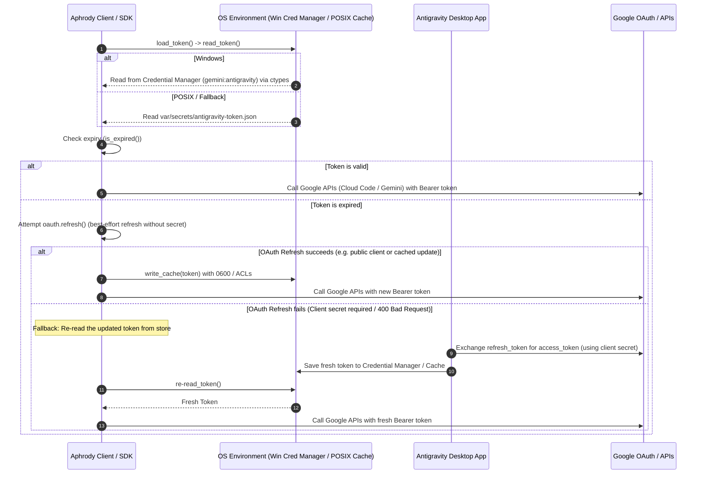
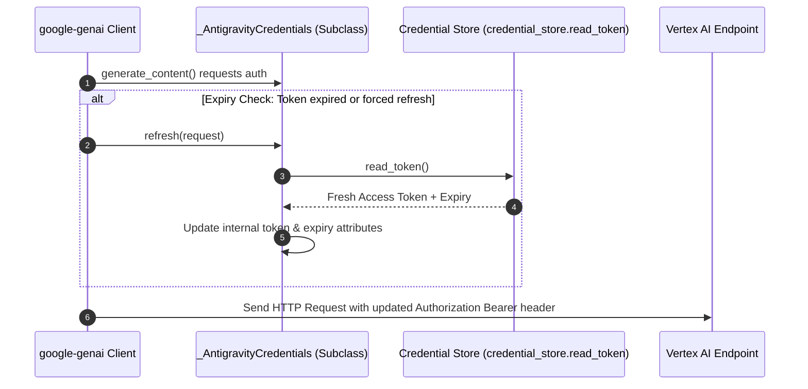
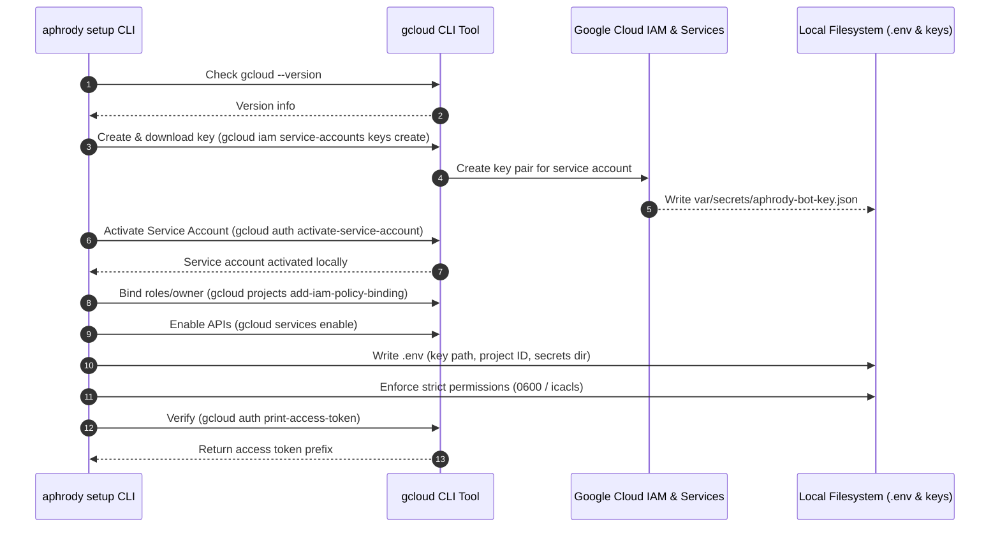

# Aphrody Authentication Architecture & Developer Onboarding Guide

Welcome to Aphrody! This guide provides a comprehensive walkthrough of Aphrody's authentication architecture, local secrets management, credential manager integration, and the token extraction pathways.

As an onboarding developer, understanding this pipeline is key to working on Aphrody's command-line interface (CLI) and backend APIs.

---

## 1. Keyless Authentication Philosophy

Aphrody is designed with a **keyless authentication** philosophy. Developers and users should never need to manually copy, paste, or embed static Google API keys or credentials in code or public configurations. 

To achieve this, Aphrody supports two primary identity modes:
1. **User Accounts (Default & Local Development)**: Reads Google OAuth 2.0 tokens managed by the **Antigravity desktop client** (or CLI).
2. **Service Accounts (Local Automation & Server Deployments)**: Configured automatically via the `aphrody setup` workflow using `gcloud` to download a key and set up local environments.

Additionally, all legacy client-side web automation, Google keyless operations (e.g., Google Books, Public DNS, Translate), and Chrome cookie extraction tools have been migrated to the `bxc` repository as of 2026-06-01. The Python client inside `aphrody` delegates these tasks to `bxc` via a subprocess client helper (`BxcGeminiWebClient`) for review and backend tools.

---

## 2. The Credential Manager (`aphrody/auth/credential_store.py`)

The source of truth for user account tokens is the OS-native credential manager. Aphrody abstracts access to this store via the `aphrody.auth.credential_store` module.

### Windows Credential Manager (`ctypes` & `advapi32.dll`)
On Windows, Aphrody integrates directly with the **Windows Credential Manager** to read generic credentials stored under the target name **`gemini:antigravity`**. 

This interface is implemented using Python's `ctypes` library to load `advapi32.dll` and make low-level Win32 API calls:
* **`CredReadW`**: Retrieves the credential blob from the Windows Credential Manager.
* **`CredWriteW`**: Persists or updates the credential blob (used when saving refreshed tokens).
* **`CredFree`**: Frees the memory buffer allocated by the Windows Local Security Authority Subsystem Service (LSASS).

> [!IMPORTANT]
> **LSASS Memory Safety**: To ensure credential blobs are not leaked or corrupted, the raw buffer retrieved from LSASS is copied immediately into a native Python `bytes` object (`bytes(pcred.contents.CredentialBlob[:size])`) within a `try...finally` block. The memory allocated by the DLL is guaranteed to be freed via `CredFree(pcred)` immediately after copying, preventing memory safety issues.

### POSIX Fallback & Cache File
On non-Windows platforms (like Linux or macOS) or as a fallback cache, Aphrody uses a private file named `antigravity-token.json`.
* **Path Resolution**: The path defaults to `var/secrets/antigravity-token.json` when running in a repository workspace, or `~/.aphrody/antigravity-token.json` in global installations.
* **Override Hook**: Developers can override this path by setting the `APHRODY_TOKEN_PATH` environment variable.

### Cross-Platform File Permissions Enforcement
To prevent unauthorized local users from reading sensitive OAuth tokens or private key files, Aphrody strictly enforces file permissions:

```python
def enforce_private_permissions(path: Path) -> None:
    if os.name == "nt":
        username = os.environ.get("USERNAME")
        if username:
            import subprocess
            # Disables inheritance and grants Full access only to the current Windows user
            subprocess.run(
                [
                    "icacls",
                    str(path),
                    "/inheritance:r",
                    "/grant:r",
                    f"{username}:(F)",
                ],
                capture_output=True,
                text=True,
                check=False,
            )
    else:
        try:
            # Applies 0600 owner-only read-write permissions
            os.chmod(path, stat.S_IRUSR | stat.S_IWUSR)
        except OSError:
            pass
```

When writing files (such as caching a token via `write_cache()`), Aphrody secures creation at the system level by calling `os.open` with a strict `0o600` mode flag mask, alongside `os.O_CREAT | os.O_WRONLY | os.O_TRUNC` (and `os.O_BINARY` on Windows).

---

## 3. Token Extraction & Keyless Refresh Path

When an API client (like `AphrodyClient` or a Vertex AI helper) makes a request, it requires a valid, active Google access token. 

### The Extraction Workflow
The standard retrieval path is:
1. Call **`credentials.load_token()`**.
2. Call **`credential_store.read_token()`** to fetch the raw token blob.
   * On Windows, it attempts `read_windows_credential()`. If not found, it falls back to checking the local file cache via `read_cache()`.
   * On POSIX, it queries `read_cache()` directly.
3. Parse the retrieved JSON envelope into a typed `OAuthToken` dataclass.

### The Keyless Refresh Strategy (The Confidential Client Problem)
Google OAuth 2.0 desktop and installed applications are registered as **confidential clients**. Under Google's authentication policy, exchanging a `refresh_token` for a fresh `access_token` requires a `client_secret`. 

Because a CLI like Aphrody cannot securely embed or ship client secrets, calling Google's token endpoint directly with a standard refresh grant will fail. Aphrody solves this using a two-tier strategy:

1. **Active Refresh Attempt (Best-Effort)**: Aphrody sends a form POST to Google's token endpoint (`oauth.refresh()`) with the client ID and the refresh token, omitting the client secret.
2. **Credential Store Pull-Through (Core Fallback)**: If Google rejects the refresh grant (raising an `OAuthServerError`), Aphrody catches the error and **re-reads the credential store**. The companion **Antigravity desktop application** (which holds the client secret and runs alongside the user's session) automatically refreshes the token in the OS Credential Manager. Aphrody pulls the freshly updated token directly from the store, keeping the CLI completely keyless and credential-free.

### Vertex AI Integration (`google-genai` Adapter)
Vertex AI requests made via `google-genai` require a `google.oauth2.credentials.Credentials` instance. To enforce our keyless philosophy, Aphrody overrides the default credentials refresh process:

```python
def to_google_credentials(token: OAuthToken) -> Credentials:
    from google.oauth2.credentials import Credentials

    class _AntigravityCredentials(Credentials):
        def refresh(self, request: object) -> None:
            # Overridden to pull from the local store rather than making direct HTTP refresh requests
            try:
                fresh = credential_store.read_token()
            except Exception:
                return
            self.token = fresh.access_token
            self.expiry = _naive_utc_expiry(fresh.expiry)

    return _AntigravityCredentials(
        token=token.access_token,
        refresh_token=token.refresh_token,
        token_uri=endpoints.OAUTH_TOKEN_ENDPOINT,
        client_id=endpoints.ANTIGRAVITY_CLIENT_ID,
        client_secret=None,
        scopes=list(endpoints.ANTIGRAVITY_SCOPES),
        expiry=_naive_utc_expiry(token.expiry),
    )
```

By substituting the default refresh callback with a pull-through from `credential_store.read_token()`, any Google client library (e.g., Vertex AI text generation) remains completely functional and keyless.

---

## 4. Service Account Setup & GCloud Activation (`setup.py`)

For automated testing, local scripting, or headless environments, Aphrody provides a CLI command:
```bash
aphrody setup
```
This command runs `setup_secrets()` in `aphrody/cli/setup.py` to configure a local service account environment.

### Execution Steps
1. **Repository Root Resolution**: Dynamically resolves the repository root directory by walking up from the current directory looking for a `.git` folder.
2. **GCloud Environment Verification**: Checks if the `gcloud` CLI is installed and accessible in the system `PATH`.
3. **Secrets Directory Provisioning**: Creates `var/secrets/` in the repository root.
4. **Key Generation & Download**: Runs `gcloud iam service-accounts keys create` to generate a new key for the service account `aphrody-bot@aphrody.iam.gserviceaccount.com` and writes it to `var/secrets/aphrody-bot-key.json`.
5. **GCloud Activation**: Runs `gcloud auth activate-service-account` to log `gcloud` in as the service account using the newly created key file.
6. **IAM Policy Binding**: Binds the service account to the `roles/owner` role for the GCP project `aphrody`.
7. **Batch API Enablement**: Enables the complete suite of required Google APIs (`aiplatform`, `drive`, `sheets`, `translate`, `books`, `dns`, `generativelanguage`, `iam`, `cloudresourcemanager`, and `docs`) in a single execution of `gcloud services enable`.
8. **Environment Configuration (.env)**: Writes a `.env` file containing the paths and IDs using cross-platform forward-slash format:
   ```env
   GOOGLE_APPLICATION_CREDENTIALS=var/secrets/aphrody-bot-key.json
   APHRODY_SECRETS_DIR=var/secrets
   GOOGLE_CLOUD_PROJECT=aphrody
   VERTEX_PROJECT=aphrody
   ```
9. **Strict Permissions Application**: Invokes `enforce_private_permissions` on both the downloaded service account key file and the generated `.env` file.
10. **Validation**: Verifies successful setup by executing `gcloud auth print-access-token`.

---

## 5. Data Flow Diagrams

The following diagrams illustrate the credential management, token extraction, and setup sequences.

### User Account Authentication & Refresh Flow



### Keyless Vertex AI Refresh Flow



### Service Account Setup Flow (`aphrody setup`)


