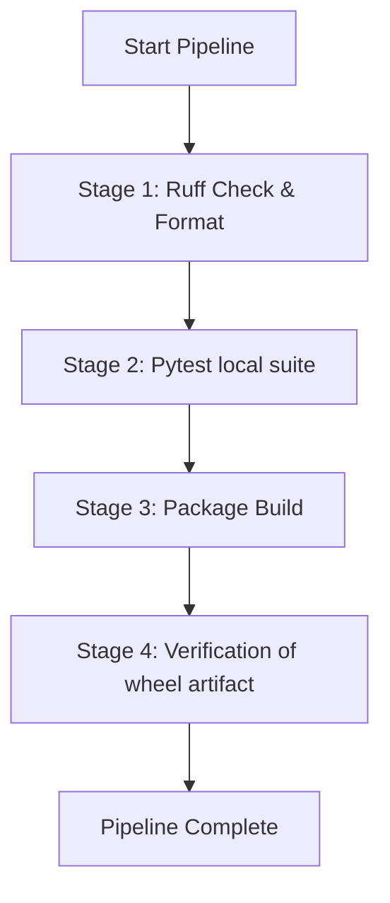

# Aphrody Automation & Deployment Guide

This guide explains how to automate, package, test, and deploy the keyless `aphrody` Python package and its dependencies.

---

## 1. Automated Headless Setup

The `aphrody setup` command configures the local Google Cloud SDK credentials, IAM policy bindings, and enabled APIs. It normally runs interactively, but can be fully automated using environment variables or command-line parameters.

### CLI Overrides

Pass settings directly via CLI flags:

```bash
uv run aphrody setup \
  --project=my-custom-project-id \
  --service_account=my-custom-sa@my-custom-project-id.iam.gserviceaccount.com \
  --location=europe-west9
```

### Environment Variable Overrides

Alternatively, set environment variables prior to running the setup command:

```bash
# Set variables
export APHRODY_PROJECT_ID="my-custom-project-id"
export APHRODY_SERVICE_ACCOUNT="my-custom-sa@my-custom-project-id.iam.gserviceaccount.com"
export APHRODY_LOCATION="europe-west9"

# Execute headless setup
uv run aphrody setup
```

### Headless Verification Flow

When running headlessly (either with CLI overrides or environment variables, without `-i` or `--interactive` flag):
1. **Repository root** is dynamically resolved (searches parent folders containing `.git`).
2. **`gcloud` CLI installation** is checked.
3. **Secrets Directory** (`var/secrets/` in-repo or `~/.aphrody`) is created with locked permissions (`0700`).
4. **Service account keys** are created and saved securely (`0600` permissions).
5. **GCloud authorization** activates the service account key.
6. **IAM Policy** adds owner bindings to the service account.
7. **APIs** are batch-enabled for the project.
8. **`.env` configuration file** is generated with forward slashes, locked to `0600` permissions.
9. **Access token** print is tested.

---

## 2. Packaging & Verification Pipeline

We supply an automated verification tool to test, lint, format, and package the repository.

```bash
uv run python aphrody/scripts/build_verify.py
```

This script performs a 4-stage pipeline:



- **Stage 1 (Linter & Formatter)**: Runs `ruff check` and `ruff format --check`.
- **Stage 2 (Local Unit Tests)**: Runs `pytest -m "not live_api"`.
- **Stage 3 (Package Build)**: Cleans older builds and executes `uv build --package aphrody --wheel` (or fallback `python -m build`).
- **Stage 4 (Artifact Verification)**: Validates that the `.whl` package exists and has a non-trivial file size.

---

## 3. Autopilot Background Loops

The repository includes loop scripts to run background tasks continuously (e.g. for continuous development or cron operations). The loop reads tasks from `docs/PLAN.md`, starts executing them with Claude Code, audits them with Gemini, and marks them completed.

### Linux / Unix / macOS (Bash)

To start the loop:
```bash
./aphrody/scripts/autopilot.sh --interval 60 &
```
- **Interval**: Frequency of execution ticks (in seconds).
- **Max Ticks**: Exits after a set number of loops (e.g., `--max-ticks 10`).
- **Single Run**: `--once` runs a single tick and exits.
- **Process ID**: Logged to `var/run/autopilot.pid`.
- **Logs**: Written as NDJSON format to `var/log/autopilot.jsonl`.
- **Heartbeats**: Emitted to `ai/heartbeat.txt`.

### Windows (PowerShell)

To start the loop:
```powershell
.\aphrody\scripts\autopilot.ps1 -Interval 60
```
- Accepts the same parameters (`-Interval`, `-MaxTicks`, `-Once`).
- Runs background execution lanes using PowerShell Jobs.

---

## 4. VPS systemd Integration

Deploying to a Linux VPS is managed via `deploy/deploy-vps.sh` and two systemd service unit templates:
- `aphrody.service` (for a standard React static/SPA site server)
- `aphrody-rust.service` (for fronting or supervising a Rust backend)

### Serving React / SPA Web App

1. Build the wheel package on your development machine and transfer it along with the deploy scripts to the VPS:
   ```bash
   uv build --package aphrody --wheel
   scp dist/aphrody-*.whl deploy/* user@vps-ip:/tmp/aphrody-deploy/
   ```

2. Log into the VPS and execute the bootstrap script as root:
   ```bash
   sudo ./deploy-vps.sh --mode react --wheel /tmp/aphrody-deploy/aphrody-0.1.0-*.whl \
        --site /srv/site --host 0.0.0.0 --port 8080
   ```

### Supervising a Rust Backend

Deploy the Rust binary and trigger:
```bash
sudo ./deploy-vps.sh --mode rust --wheel /tmp/aphrody-deploy/aphrody-0.1.0-*.whl \
     --binary /opt/myapp/bin/myapp
```

### HARDENING / SECURITY
- A system-level `aphrody` service user is created with home directory `/opt/aphrody` and shell `/usr/sbin/nologin`.
- Files in `/etc/aphrody` and home directories are strictly chowned to `aphrody:aphrody`.
- Environment variable configuration files (`/etc/aphrody/serve.env`) are kept isolated.
- systemd configurations limit memory usage using `MemoryHigh=2G` and `MemoryMax=4G`.

---

## 5. Dockerized Deployment

You can build and run `aphrody` inside a lightweight container.

### Build the Image
```bash
docker build -f aphrody/deploy/Dockerfile -t aphrody-serve aphrody
```

### Run the Container
Mount your built React/static front-end folder at `/srv/site`:
```bash
docker run --rm -p 8080:8080 -v /path/to/dist:/srv/site:ro aphrody-serve
```

To reverse-proxy API requests (e.g. `/api/*`) to a running backend at `http://backend:3000`, override the container entrypoint or run:
```bash
docker run --rm -p 8080:8080 \
  -v /path/to/dist:/srv/site:ro \
  aphrody-serve \
  sh -c 'aphrody serve "/srv/site" --host "0.0.0.0" --port 8080 --proxy "http://backend:3000" --cache'
```

---

## 6. Permissions and Hardening Guidelines

To prevent host cookie or service account credential leakages, `aphrody` enforces strict owner-only permissions:
- On POSIX: Directory permissions are locked to `0700` and files to `0600`.
- On Windows: Inheritance is disabled using `icacls`, granting Full Control (`(F)`) only to the executing user.

If you encounter permission issues in automated pipelines:
1. Ensure the running process user has ownership of the directories.
2. In non-Windows docker containers, files inside mounted volumes might complain if the container user doesn't map to host file owner IDs. Use `USER root` during setup if mounting host paths, or run chown accordingly inside the container.
