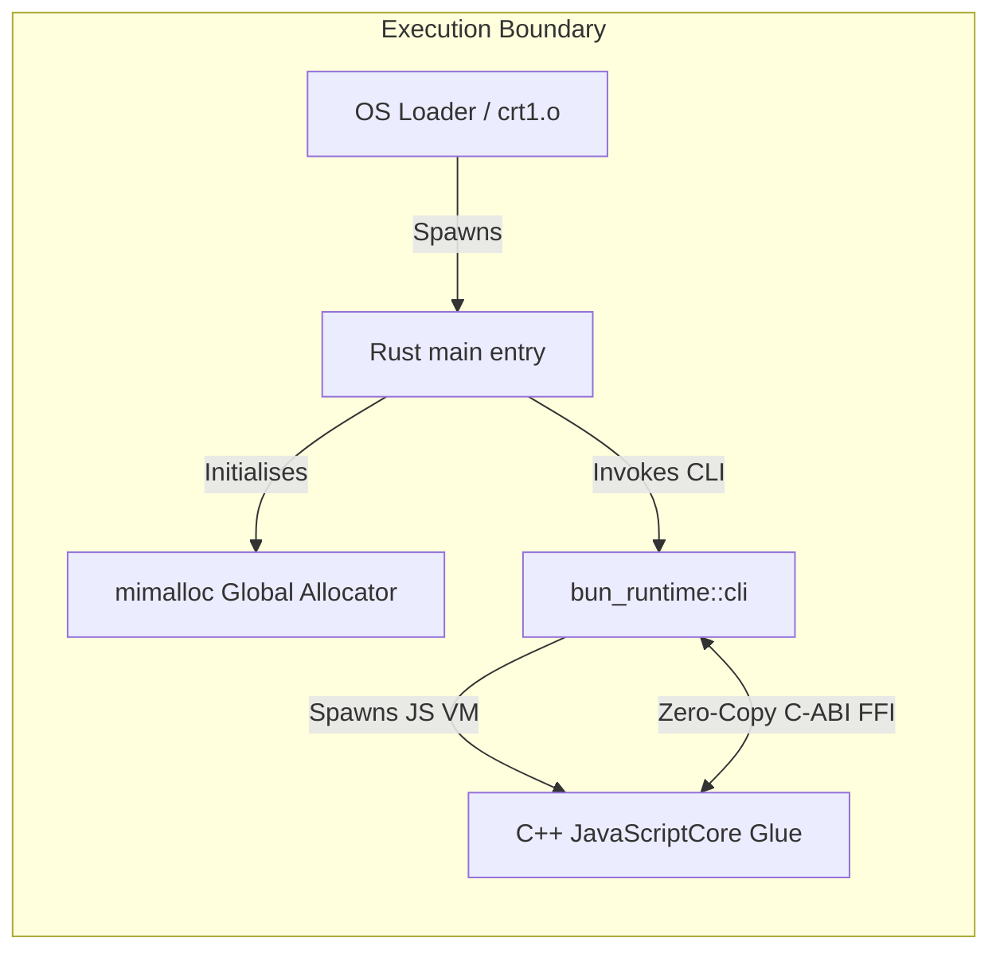

# Architectural Report: The Rust-Bun Integration (bun-rs)

This report details the deep integration between Rust and Bun inside the `bun` repository (`/tmp/bun`). It outlines how Rust has become the primary driver of Bun’s runtime and build pipeline, replacing Zig and interfacing directly with C++ and JavaScriptCore (JSC).

---

## 1. Executive Summary & Architecture Shift

Bun has completed a transition from a runtime written primarily in Zig to a **hybrid Rust + C++ architecture**. 



* **Rust's Role:** Acts as the entry point, orchestrates system initialization, memory management, and houses the implementation for all high-performance subsystems (the bundler, the package manager, the test runner, and the custom event loop).
* **C++'s Role:** Manages the low-level glue interfacing with the WebKit/JavaScriptCore (JSC) Virtual Machine.
* **Zig's Role (Deprecated):** The Zig compiler is no longer used in the build process. Sibling `.zig` files exist solely as a developer spec/reference for porting semantics.

---

## 2. Process Entry Point (`src/bun_bin/lib.rs`)

The process entry point is implemented entirely in Rust under the `bun_bin` static library crate. The operating system loader calls Rust’s `main` symbol:

```rust
#[unsafe(no_mangle)]
pub unsafe extern "C" fn main(argc: c_int, argv: *const *const c_char) -> c_int
```

### Startup Initialization Chain
1. **Argument Capture:** Immediately calls `bun_core::init_argv` to grab `argv` pointers before constructors run, guaranteeing proper stack inspection.
2. **Crash & Panic Handler:** Initialises `bun_crash_handler::init()` to catch signals and dump symbolized stack traces.
3. **Signal Configurations:** Ignores `SIGPIPE` and `SIGXFSZ` to prevent crashing on interrupted socket writes.
4. **Allocator & OS Hooks (Windows):** Intercepts standard Libuv allocations using `uv_replace_allocator` mapping to `mimalloc`, and converts the host environment block to WTF-8.
5. **Stdio Buffering:** Configures stdio handles and locks flush guards.
6. **Thread Configuration:** Sets thread stack bounds via `StackCheck::configure_thread()` for JS recursion safety.
7. **CLI Dispatch:** Calls `bun_runtime::cli::Cli::start()` to run the command loop.

---

## 3. Shared Memory Allocator & Zero-Copy Interop

Rust and C++ share a single global memory allocator to enable zero-copy FFI without double-freeing or garbage collection bottlenecks.

```
       [ Rust Allocations ]                  [ JSC Allocations ]
                 \                                  /
                  \                                /
                   v                              v
            [ mimalloc global allocator (libbun_rust.a) ]
```

* **Global Allocation Override:** When ASAN is disabled, Rust registers `mimalloc` as its global allocator (`static ALLOC: bun_alloc::Mimalloc = bun_alloc::Mimalloc;`).
* **C Allocator Thunks (`src/bun_alloc/c_thunks.rs`):** Routing hooks are provided for C libraries (like zlib, brotli, and JSC) to delegate their memory lifecycle straight to mimalloc:
  * `mi_malloc_items`: Hooks zlib's allocation to mimalloc.
  * `mi_free_opaque` / `mi_free_ctx`: Frees opaque context buffers safely.
  * `mi_free_bytes`: Allows JavaScriptCore's `JSTypedArrayBytesDeallocator` to free typed arrays back to Rust's allocator space directly.

---

## 4. Rust C-ABI Export Boundaries (`phase_c_exports.rs`)

The bridge between C++ and Rust is formed via `#[unsafe(no_mangle)] extern "C"` functions. During the migration phase, the `phase_c_exports.rs` file served as a transient link catalog, which has now been decentralized into the individual crates:

* **Subsystem Exports:**
  * **JSC Virtual Machine (`bun_jsc`):** Handles task queue scheduling (`Bun__queueTaskConcurrently`), error reporting (`Bun__reportUnhandledError`), and heap diagnostics.
  * **Network & Sockets (`bun_uws`):** Dispatches Usockets events (`us_dispatch_data`, `us_dispatch_handshake`) straight to the Rust client wrappers.
  * **DNS Resolvers (`bun_runtime`):** Resolves getaddrinfo async requests in Rust and reports back to JSC.
  * **Bundler & Analyzer (`bun_bundler_jsc`):** Handles deserialization of transpiled JS module records (`zig__ModuleInfoDeserialized__toJSModuleRecord`).

---

## 5. Automated Code Generation (`src/codegen`)

To prevent the Rust, C++, and JS interfaces from drifting, the codebase uses TypeScript code generators:

* **`generate-classes.ts`**: Translates `.classes.ts` templates defining prototypes, getters, and setters into corresponding Rust structs (`generated_classes.rs`) and C++ headers.
* **`cppbind.ts`**: Scans C++ source code for annotations and auto-generates FFI signatures in Rust (`cpp.rs`).
* **`generate-string-map.ts`**: Generates Rust string maps (`.generated.rs`) to accelerate string parsing and symbol identification.

---

## 6. Build Pipeline & Toolchain Linkage

Because Rust compilation links C/C++ objects, the build is orchestrated using custom scripts that link both toolchains together.

* **Advisory Cargo Config (`cargo-config.ts`):** Dynamically generates `.cargo/config.toml` at configure time. It resolves the absolute system paths to `clang++` and links targets to `-fuse-ld=lld` so compilers use the same linker.
* **Cargo Build Executor (`rust.ts`):** Invokes Cargo to build the `bun_bin` static library.
  * For release builds, LTO builds, and ASAN instrumentation, it appends `-Zbuild-std=core,alloc,std,proc_macro,panic_abort` to recompile the standard library with matching compiler flags.
  * The final output `libbun_rust.a` is merged directly with the C++ objects in the Ninja link stage.
