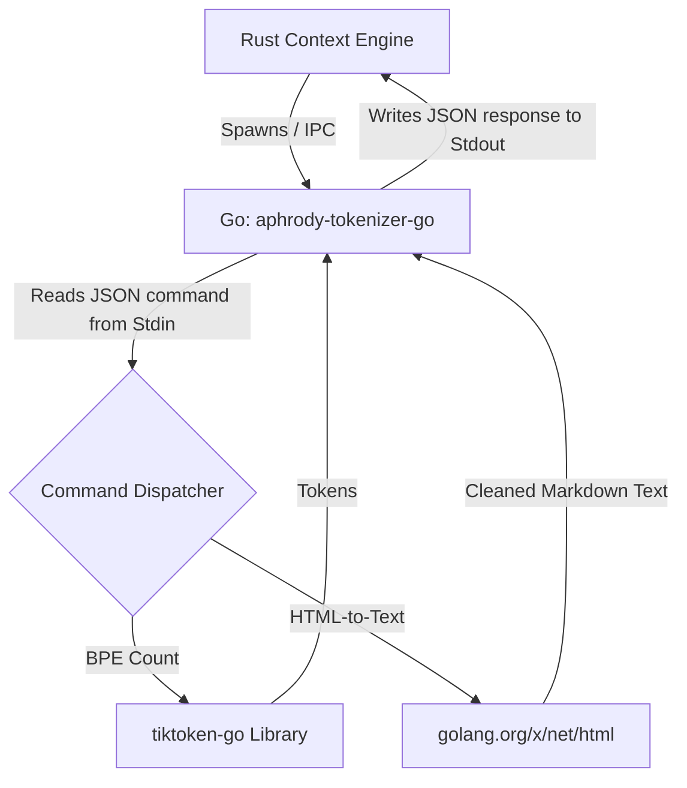

# Go Architecture — aphrody

This document describes the Go-based sub-systems within `aphrody`.

Currently, Go is leveraged to handle two key performance-sensitive tasks:
1. **Exact BPE (Byte-Pair Encoding) tokenization** (`go/aphrody-tokenizer-go`) without bloating the core Rust binary with heavy tokenization tables or Python runtime requirements.
2. **HTML-to-text/markdown-like parsing and extraction** leveraging Google's official HTML parser sub-repository (`golang.org/x/net/html`) to clean raw web page context.

---

## 1. Bird's-Eye View

The Go tokenizer operates as a decoupled companion executable (`aphrody-tokenizer-go`). The core Rust application interacts with it via process spawning and standard input/output (IPC).



---

## 2. IPC Protocol & JSON Schemas

Communication uses a line-oriented or single-shot JSON exchange via Standard Input (`stdin`) and Standard Output (`stdout`).

### 2.1 BPE Token Counting Schema

#### Stdin Request Schema
```json
{
  "encoding": "cl100k_base",
  "text": "hello world"
}
```

* **`encoding`** (optional, defaults to `cl100k_base`): The target BPE encoding to use. Currently supported:
  * `cl100k_base` / `cl100k` (Claude 3 / GPT-4)
  * `o200k_base` / `o200k` (GPT-4o)
  * `p50k_base` / `p50k` (Codex)
  * `r50k_base` / `r50k` / `gpt2` (GPT-2 / GPT-3)
* **`text`**: The input string to tokenize.

#### Stdout Response Schema
On success:
```json
{
  "tokens": 2
}
```

On failure:
```json
{
  "error": "unknown encoding: invalid_name"
}
```

---

### 2.2 HTML-to-Text Parser Schema

#### Stdin Request Schema
```json
{
  "command": "html2text",
  "html": "<h1>My Header</h1><p>Check out <a href='https://example.com'>this link</a>.</p>"
}
```

* **`command`**: Must be set to `"html2text"`.
* **`html`**: The raw HTML string to be stripped and formatted.

#### Stdout Response Schema
On success:
```json
{
  "text": "# My Header\n\nCheck out [this link](https://example.com)."
}
```

On failure:
```json
{
  "error": "failed to parse HTML: <reason>"
}
```

---

### 2.3 Context Caching Schemas

The context caching API allows caching large documents or prompt prefixes to reduce latency and token costs.

#### Create Cache Request (`create_cache`)
```json
{
  "command": "create_cache",
  "model": "gemini-2.5-flash",
  "prompt": "Large context dataset contents...",
  "display_name": "my-shared-cache",
  "ttl_seconds": 300
}
```

#### Response (Returns `CachedContent` object)
```json
{
  "cache": {
    "name": "cachedContents/...",
    "model": "models/gemini-2.5-flash",
    "createTime": "2026-05-21T18:00:00Z",
    "updateTime": "2026-05-21T18:00:00Z",
    "expireTime": "2026-05-21T18:05:00Z"
  }
}
```

---

### 2.4 Files API Schemas

The Files API allows uploading large media files (videos, images, audio, PDFs) for multimodal input.

#### List Files Request (`list_files`)
```json
{
  "command": "list_files"
}
```

#### Response (Returns list of `File` metadata)
```json
{
  "files": [
    {
      "name": "files/...",
      "displayName": "input-video.mp4",
      "mimeType": "video/mp4",
      "sizeBytes": "1048576"
    }
  ]
}
```

---

### 2.5 Multimodal Live WebSocket Schema

The Multimodal Live API provides low-latency bidirectional streaming using WebSockets.

#### Live Chat Single-shot IPC Request (`live_chat`)
```json
{
  "command": "live_chat",
  "model": "gemini-2.5-flash",
  "prompt": "Hello!",
  "system_instruction": "Answer briefly."
}
```

#### Response
```json
{
  "text": "Hello! How can I help you today?"
}
```

### 2.6 Models API Schemas

The Models API allows listing available models and querying metadata for a specific model.

#### List Models Request (`list_models`)
```json
{
  "command": "list_models",
  "filter": "state=ACTIVE",
  "query_base": true
}
```

#### Response (Returns list of `Model` objects)
```json
{
  "models_list": [
    {
      "name": "models/gemini-2.5-flash",
      "displayName": "Gemini 2.5 Flash",
      "description": "...",
      "supportedGenerationMethods": ["generateContent", "countTokens"]
    }
  ]
}
```

#### Get Model Request (`get_model`)
```json
{
  "command": "get_model",
  "model": "models/gemini-2.5-flash"
}
```

#### Response (Returns `Model` object)
```json
{
  "model_info": {
    "name": "models/gemini-2.5-flash",
    "displayName": "Gemini 2.5 Flash",
    "description": "..."
  }
}
```

---

### 2.7 Tunings API Schemas

The Tunings API allows creating fine-tuning jobs (SFT/Symmetric), checking their status, listing jobs, and canceling them.

#### Tune Model Request (`tune_model`)
```json
{
  "command": "tune_model",
  "base_model": "models/gemini-2.5-flash",
  "tuning_dataset": {
    "gcsUri": "gs://my-bucket/training.jsonl"
  },
  "tuned_model_display_name": "My Tuned Model",
  "description": "SFT fine-tuned model"
}
```

#### Response (Returns `TuningJob` object)
```json
{
  "tuning_job": {
    "name": "tuningJobs/...",
    "state": "ACTIVE",
    "createTime": "2026-05-21T18:00:00Z"
  }
}
```

#### Get Tuning Job Request (`get_tuning_job`)
```json
{
  "command": "get_tuning_job",
  "name": "tuningJobs/..."
}
```

#### Response (Returns `TuningJob` object)
```json
{
  "tuning_job": {
    "name": "tuningJobs/...",
    "state": "SUCCEEDED"
  }
}
```

---

## 3. Rust-to-Go IPC Bridge

Inside the `aphrody-context` crate, the `GoTokenEstimator` manages the interaction:

1. **Resolution**: The Rust coordinator resolves the compiled Go binary path using multiple search steps (Env override `APHRODY_TOKENIZER_GO_BIN`, sibling binary location, system `PATH` walk, and repository parent lookup).
2. **Process Spawn**: The binary is executed with piped stdin/stdout and silent stderr.
3. **JSON Serialization**: The Rust estimator writes the JSON payload representing either a tokenization or extraction query to stdin.
4. **Fallback Handling**: If spawning, piping, writing, or reading fails (or if Go returns an error object), the estimator gracefully falls back to the local `HeuristicTokenEstimator` to prevent crashing the host process.

---

## 4. Compilation & Deployment

The Go binary is compiled target-native:
* On Windows: `aphrody-tokenizer-go.exe`
* On Linux/macOS: `aphrody-tokenizer-go`

During development or verification tests, the binary can be compiled locally:
```bash
cd go/aphrody-tokenizer-go
go build -o aphrody-tokenizer-go.exe main.go
```

The compiled binary is placed adjacent to the running binary or in `go/aphrody-tokenizer-go/` to allow automated tests to automatically resolve it.

### CLI Manual Verification

You can verify the subcommands manually from the command line:

```bash
# Test exact token count
.\aphrody-tokenizer-go.exe count cl100k_base "Hello, world!"
# Output: 4

# Test HTML-to-text parsing via inline args
.\aphrody-tokenizer-go.exe html2text "<h1>Title</h1><p>Text</p>"
# Output:
# # Title
#
# Text

# Test HTML-to-text parsing via stdin pipe
echo "<div>Hello <span>world</span></div>" | .\aphrody-tokenizer-go.exe html2text
# Output: Hello world

# Create a Context Cache for large prompt input
.\aphrody-tokenizer-go.exe create_cache gemini-2.5-flash "Here is some large background text to cache" "my-cache-display-name"

# List active caches
.\aphrody-tokenizer-go.exe list_caches

# Get metadata of a specific cache
.\aphrody-tokenizer-go.exe get_cache "cachedContents/12345abcde"

# Delete a cache resource
.\aphrody-tokenizer-go.exe delete_cache "cachedContents/12345abcde"

# Upload a file via Gen AI Files API
.\aphrody-tokenizer-go.exe upload "C:\path\to\document.pdf" "DocumentDisplayName"

# List uploaded files
.\aphrody-tokenizer-go.exe list_files

# List all available models
.\aphrody-tokenizer-go.exe list_models

# Get metadata of a specific model
.\aphrody-tokenizer-go.exe get_model models/gemini-2.5-flash

# Start a fine-tuning job on a model using SFT dataset GCS URI
.\aphrody-tokenizer-go.exe tune_model models/gemini-2.5-flash gs://my-bucket/dataset.jsonl "My Tuned Model"

# Retrieve metadata of a fine-tuning job
.\aphrody-tokenizer-go.exe get_tuning_job tuningJobs/my-tuning-job-id

# List all active tuning jobs
.\aphrody-tokenizer-go.exe list_tuning_jobs

# Cancel a running tuning job
.\aphrody-tokenizer-go.exe cancel_tuning_job tuningJobs/my-tuning-job-id

# Run interactive console chat over Live WebSocket API (modalities=TEXT)
.\aphrody-tokenizer-go.exe live_chat gemini-2.5-flash "You are a helpful assistant"
```

---

## 5. Style Decisions & Guidelines

Go development in `aphrody` adheres strictly to the **Google Go Style Guide** (documented in [guide.md](guide.md) and [decisions.md](decisions.md)):

* **Clarity & Simplicity**: Keep the binary specialized. Avoid building extra layers, databases, or networking inside the tokenizer companion.
* **Errors over Panics**: Never panic. All errors (unrecognized encoding, serialization issues, empty values) are captured and returned cleanly via JSON or printed to `stderr` with non-zero exit codes.
* **Google Sub-repositories Integration**: For low-level HTML tokenization, the project utilizes the official Google-maintained sub-repository `golang.org/x/net/html` to ensure performance, compliance, and standard formatting.
* **No AI trailers or leaks**: Avoid AI comments/fingerprints. Maintain SPDX-License headers on all new source files.

