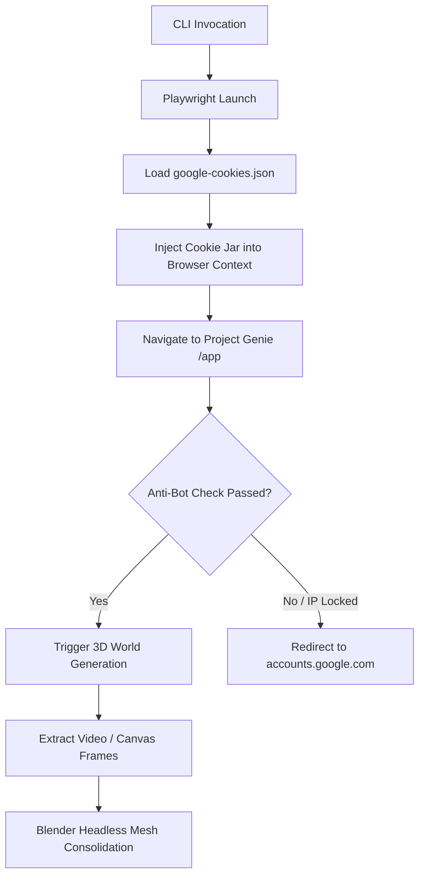

<!-- SPDX-License-Identifier: Apache-2.0 -->
# Headless Browser Automation & 3D World Generation on Linux

This document details how Aphrody automates Chromium headlessly on Linux for web-scraping interfaces (like Google Labs Project Genie) and consolidates 3D scenes.

---

## 1. Browser Automation Architecture

Aphrody uses **Playwright** (under Python and TypeScript workspaces) to interact with Google Web Applications without API keys.



### Anti-Bot & Virtual Framebuffer (`xvfb-run`)
Headless Chromium is frequently flagged by anti-bot monitors (like Cloudflare or Google's security layers) due to missing window dimensions, webgl signatures, and automation flags.

To bypass these blocks on headless Linux nodes, execute scripts inside a virtual framebuffer:
```bash
# Install Xvfb
sudo apt install -y xvfb

# Run diagnostics or scraping tools under Xvfb
xvfb-run --server-args="-screen 0 1280x1024x24" uv run python3 scratch/diagnose.py
```

### Chromium Startup Options
In the Python/TS scrapers, Playwright launches with argument flags to suppress automation telemetry:
```python
args = [
    "--disable-blink-features=AutomationControlled", # Hides navigator.webdriver
    "--no-sandbox",                                   # Required under root/docker
    "--window-size=1280,1024"
]
```

---

## 2. Google Cookie Jar Structure

Cookies are loaded from the private store at `var/secrets/google-cookies.json` using `CookieJar`.

### Cookie JSON Layout
The JSON should map directly to standard JSON cookie exporters (such as Cookie-Editor):
```json
[
  {
    "name": "__Secure-1PSID",
    "value": "g.a000-QjXcK8...",
    "domain": ".google.com",
    "path": "/",
    "secure": true,
    "httpOnly": true
  },
  {
    "name": "__Secure-1PSIDTS",
    "value": "sidts-Cjc...",
    "domain": ".google.com",
    "path": "/",
    "secure": true,
    "httpOnly": true
  },
  {
    "name": "__Secure-1PSIDCC",
    "value": "AKEyXz...",
    "domain": ".google.com",
    "path": "/",
    "secure": true,
    "httpOnly": true
  }
]
```

---

## 3. The Google Session IP-Locking Phenomenon

Google accounts employ advanced geographic and session-fingerprint locking. When a session cookie exported from a user's residential IP is injected into a VPS browser instance:
1. Google's server flags the IP address mismatch (datacenter vs residential ISP).
2. The anti-hijacking guard invalidates the session or prompts for high-trust verification (OAuth/identifier redirect).
3. Playwright is redirected to: `https://accounts.google.com/v3/signin/identifier`.

### Pipeline Mitigation
To maintain an autonomous workflow, the creative pipelines implement a **Pre-Existing Retaining Fallback** and **Mock Mode**:
- Set `APHRODY_GENIE_MOCK=1` or run inside an offline dev environment to bypass browser automation and use local depth projection fallbacks.
- When generating images in a loop, the pipeline checks for pre-existing high-fidelity assets at target locations. If API token validation fails, it retains the existing files instead of overwriting them with mock placeholders.

---

## 4. Headless 3D Mesh Consolidation via Blender

Once Project Genie generates a 3D world video/frame sequence:
1. Keyframes are extracted via `ffmpeg` (e.g. at intervals to `var/genie_temp/frame_*.png`).
2. The heightmap relief conversion generates `var/genie_temp/mesh.glb`.
3. Aphrody's `BlenderRunner` spawns a headless Blender instance to compile, orient, and export the consolidated `.glb` world scene.

```bash
# Executed under the hood:
blender --background --python var/genie_temp/consolidate.py
```
Ensure `blender` is in your `PATH` or configured via the `APHRODY_BLENDER_BIN` environment variable.
