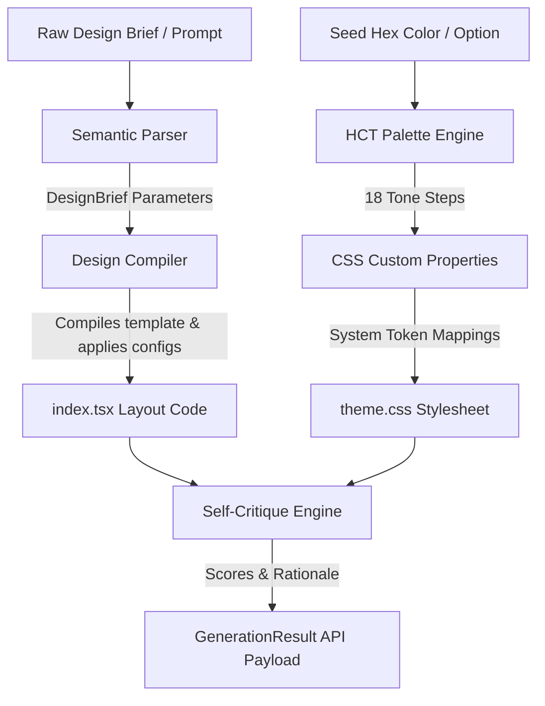

<!-- SPDX-License-Identifier: Apache-2.0 -->

# @aphrody/m3-design

`@aphrody/m3-design` is the natural-language design compiler of the **material-web** Material Design 3 monorepo. It turns raw, natural-language design briefs directly into **Material Design 3 (M3)** React scaffolds, emitting a production-ready `index.tsx` layout tree built on `@aphrody/m3-react` components, plus an HCT tonal-palette theme stylesheet and W3C design-token JSON.

It is meant to be a fast, deterministic scaffold generator for autonomous agents and tooling: it replaces manual visual-configuration forms with a semantic parser and an HCT-inspired tonal theme engine, so a single prompt yields a self-contained, type-checked React artifact.

---

## Architecture Overview

The package is split into decoupled components that translate a text spec into running code:



### 1. Semantic Parser (`src/parser.ts`)

Parses a raw natural-language prompt into structured design directives, extracting:

- **Output Kind**: target layout mode (`deck`, `prototype`, `dashboard`, `mobile`, `editorial`).
- **Adaptive Platform**: target device viewports (`desktop-web`, `ios`, `responsive-web`).
- **Layout Organization**: structural model (`scaffold`, `list-detail`, `supporting-pane`, `feed`).
- **Visual Density**: layout spacing (`high` compact, `default`, `low` loose).
- **Color Extraction**: detects hex patterns or color references (e.g. "dark blue", "compact red") to pick a seed color. The default seed is the M3 baseline `#6750A4`.
- **Feature Toggles**: auto-detects real-time streaming, thinking/shimmer indicators, and central action-router delegation.

### 2. HCT Theme Compiler (`src/hct.ts`)

Implements an approximation of Google's **HCT (Hue, Chroma, Tone)** color space using dynamic HSL transformations:

- **Sine Saturation Tuning**: drops saturation near tone boundaries (Tone 0 and Tone 100) to better match perceptual curves.
- **Tonal Palettes**: computes 18 tone steps `[0, 6, 10, 12, 20, 22, 30, 40, 50, 60, 70, 80, 90, 94, 95, 98, 99, 100]` across 6 core keys: `primary`, `secondary`, `tertiary`, `error`, `neutral`, and `neutral-variant`.
- **CSS Compilation**: maps palettes to M3 light and dark mode system tokens (e.g. `--md-sys-color-primary-container`, `--md-sys-color-surface-container`), matching the runtime `--md-sys-color-*` roles emitted by `@aphrody/material-web`.

### 3. Layout Generator (`src/generator.ts`)

The core code-generation engine. It processes the parsed `DesignBrief` and compiles the `SEED_TEMPLATE` into a finished React tree:

- **Import Aliasing**: every component in the generated artifact imports the real `Md*` export from `@aphrody/m3-react`, aliased to a friendly local name (e.g. `MdScaffold as Scaffold`, `MdType as TypeText`).
- **Layout Adapters**: mutates scaffolding structures (e.g. strips the navigation rail and adds a bottom app bar for mobile targets; restructures list items into slide sequences for deck outputs).
- **Self-Contained Primitives**: when a brief enables them, inline definitions for `ThinkingIndicator`, `StreamingText`, and the `useStreamingText` hook are injected directly into the artifact so the output compiles without external dependencies beyond `@aphrody/m3-react`.
- **Action Router / Registry**: when delegation is requested, a single root-level event handler dispatches `data-action` / `data-id` interactions through a central registry (see below).
- **Environment Injectors**: injects dark-mode classes and desaturates colors for additive environments (such as translucent AR/XR overlays).
- **Self-Critique Engine**: runs static analysis on the artifact and grades it across 5 axes: `philosophy`, `hierarchy`, `detail`, `functionalParity`, and `innovation`.

### 4. Server / CLI (`src/server.ts`)

Exposes the compiler via a Bun-native REST API server and a direct terminal CLI wrapper.

---

## Getting Started

> [!NOTE]
> bun only — `npm` and `pnpm` are not used in this monorepo. Run all tasks from this package directory (`packages/m3-design/`).

### Running via CLI

```bash
bun src/server.ts --prompt "Make a dark, compact dashboard in blue" --color "#0F52BA"
```

### Starting the HTTP Server

```bash
bun src/server.ts
```

---

## REST API Specification

### Generate Layout and Palette

- **Endpoint**: `POST /api/generate`
- **Content-Type**: `application/json`

#### Request Payload

| Field       | Type     | Required | Description                                                   |
| :---------- | :------- | :------- | :------------------------------------------------------------ |
| `prompt`    | `string` | **Yes**  | Natural language text defining design layout requirements.    |
| `seedColor` | `string` | No       | Hex string (e.g., `#6750A4`) to seed the HCT tonal generator. |

#### Response Schema (`GenerationResult`)

```json
{
  "brief": {
    "outputKind": "deck",
    "platforms": ["desktop-web"],
    "audience": "general users",
    "tones": ["minimal"],
    "seedColor": "#0F52BA",
    "scale": "8 slides",
    "constraints": "Dark mode first",
    "rawBrief": "Make a dark compact deck in blue",
    "layoutType": "scaffold",
    "density": "high",
    "hasThinkingIndicator": false,
    "hasStreaming": false,
    "hasActionRouter": false
  },
  "theme": {
    "seed": "#0F52BA",
    "palettes": {
      "primary": { "name": "primary", "tones": { "0": "#000000", "40": "#0A3B85" } }
    },
    "cssCustomProperties": ":root {\n  --md-ref-palette-primary-0: #000000; ..."
  },
  "files": [
    { "path": "src/theme.css", "content": "..." },
    { "path": "src/tokens.json", "content": "..." },
    { "path": "src/index.tsx", "content": "..." }
  ],
  "critique": {
    "scores": {
      "philosophy": 90,
      "hierarchy": 92,
      "detail": 95,
      "functionalParity": 98,
      "innovation": 94
    },
    "rationale": "M3 design compiler successfully mapped the brief..."
  }
}
```

---

## Mapped Component Catalog

The layout generator scaffolds against a catalog of components imported from `@aphrody/m3-react`. Each friendly local name aliases the real `Md*` React wrapper.

| Category           | Local Name           | Real Export            | Custom Element              |
| :----------------- | :------------------- | :--------------------- | :-------------------------- |
| **Action**         | `ElevatedButton`     | `MdElevatedButton`     | `<md-elevated-button>`      |
|                    | `FilledButton`       | `MdFilledButton`       | `<md-filled-button>`        |
|                    | `FilledTonalButton`  | `MdFilledTonalButton`  | `<md-filled-tonal-button>`  |
|                    | `OutlinedButton`     | `MdOutlinedButton`     | `<md-outlined-button>`      |
|                    | `TextButton`         | `MdTextButton`         | `<md-text-button>`          |
|                    | `IconButton`         | `MdIconButton`         | `<md-icon-button>`          |
|                    | `FilledIconButton`   | `MdFilledIconButton`   | `<md-filled-icon-button>`   |
|                    | `Fab`                | `MdFab`                | `<md-fab>`                  |
|                    | `BrandedFab`         | `MdBrandedFab`         | `<md-branded-fab>`          |
|                    | `ButtonGroup`        | `MdButtonGroup`        | `<md-button-group>`         |
|                    | `FabMenu`            | `MdFabMenu`            | `<md-fab-menu>`             |
|                    | `FabMenuItem`        | `MdFabMenuItem`        | `<md-fab-menu-item>`        |
| **Forms & Select** | `Checkbox`           | `MdCheckbox`           | `<md-checkbox>`             |
|                    | `Radio`              | `MdRadio`              | `<md-radio>`                |
|                    | `Switch`             | `MdSwitch`             | `<md-switch>`               |
|                    | `Slider`             | `MdSlider`             | `<md-slider>`               |
|                    | `AssistChip`         | `MdAssistChip`         | `<md-assist-chip>`          |
|                    | `FilterChip`         | `MdFilterChip`         | `<md-filter-chip>`          |
|                    | `InputChip`          | `MdInputChip`          | `<md-input-chip>`           |
|                    | `SuggestionChip`     | `MdSuggestionChip`     | `<md-suggestion-chip>`      |
|                    | `ChipSet`            | `MdChipSet`            | `<md-chip-set>`             |
|                    | `DatePicker`         | `MdDatePicker`         | `<md-date-picker>`          |
|                    | `TimePicker`         | `MdTimePicker`         | `<md-time-picker>`          |
| **Inputs**         | `FilledTextField`    | `MdFilledTextField`    | `<md-filled-text-field>`    |
|                    | `OutlinedTextField`  | `MdOutlinedTextField`  | `<md-outlined-text-field>`  |
| **Communication**  | `Dialog`             | `MdDialog`             | `<md-dialog>`               |
|                    | `CircularProgress`   | `MdCircularProgress`   | `<md-circular-progress>`    |
|                    | `LinearProgress`     | `MdLinearProgress`     | `<md-linear-progress>`      |
|                    | `Snackbar`           | `MdSnackbar`           | `<md-snackbar>`             |
|                    | `LoadingIndicator`   | `MdLoadingIndicator`   | `<md-loading-indicator>`    |
| **Navigation**     | `Tabs`               | `MdTabs`               | `<md-tabs>`                 |
|                    | `PrimaryTab`         | `MdPrimaryTab`         | `<md-primary-tab>`          |
|                    | `SecondaryTab`       | `MdSecondaryTab`       | `<md-secondary-tab>`        |
|                    | `Menu`               | `MdMenu`               | `<md-menu>`                 |
|                    | `MenuItem`           | `MdMenuItem`           | `<md-menu-item>`            |
|                    | `NavigationRail`     | `MdNavigationRail`     | `<md-navigation-rail>`      |
|                    | `NavigationRailItem` | `MdNavigationRailItem` | `<md-navigation-rail-item>` |
|                    | `TopAppBar`          | `MdTopAppBar`          | `<md-top-app-bar>`          |
|                    | `BottomAppBar`       | `MdBottomAppBar`       | `<md-bottom-app-bar>`       |
| **Containment**    | `List`               | `MdList`               | `<md-list>`                 |
|                    | `ListItem`           | `MdListItem`           | `<md-list-item>`            |
|                    | `Divider`            | `MdDivider`            | `<md-divider>`              |
|                    | `BottomSheet`        | `MdBottomSheet`        | `<md-bottom-sheet>`         |
|                    | `SideSheet`          | `MdSideSheet`          | `<md-side-sheet>`           |
|                    | `Carousel`           | `MdCarousel`           | `<md-carousel>`             |
|                    | `CarouselItem`       | `MdCarouselItem`       | `<md-carousel-item>`        |
| **Layout Panes**   | `Scaffold`           | `MdScaffold`           | `<md-scaffold>`             |
|                    | `Pane`               | `MdPane`               | `<md-pane>`                 |
|                    | `ListDetail`         | `MdListDetail`         | `<md-list-detail>`          |
|                    | `SupportingPane`     | `MdSupportingPane`     | `<md-supporting-pane>`      |
| **Enterprise**     | `Tooltip`            | `MdTooltip`            | `<md-tooltip>`              |
|                    | `ExpansionPanel`     | `MdExpansionPanel`     | `<md-expansion-panel>`      |
|                    | `Accordion`          | `MdAccordion`          | `<md-accordion>`            |
|                    | `GridList`           | `MdGridList`           | `<md-grid-list>`            |
|                    | `GridTile`           | `MdGridTile`           | `<md-grid-tile>`            |
|                    | `Table`              | `MdTable`              | `<md-table>`                |
|                    | `Paginator`          | `MdPaginator`          | `<md-paginator>`            |
|                    | `VirtualScroller`    | `MdVirtualScroller`    | `<md-virtual-scroller>`     |
|                    | `Stepper`            | `MdStepper`            | `<md-stepper>`              |
|                    | `Step`               | `MdStep`               | `<md-step>`                 |
|                    | `Autocomplete`       | `MdAutocomplete`       | `<md-autocomplete>`         |
|                    | `Tree`               | `MdTree`               | `<md-tree>`                 |
|                    | `TreeItem`           | `MdTreeItem`           | `<md-tree-item>`            |
| **Typography**     | `TypeText`           | `MdType`               | `<md-type>`                 |
|                    | `WebgpuCanvas`       | `MdWebgpuCanvas`       | `<md-webgpu-canvas>`        |

---

## Physical Motion Presets

In alignment with **Material Design 3 motion**, transition timings enforce standard spring profiles via CSS cubic-bezier parameters.

> [!IMPORTANT]
> Always match the correct preset mode to the visual property being animated.

- **Spatial Animations**: components moving across dimensions (expanding sidebar, dragging sliders, dialog scales).
- **Effects Animations**: opacity shifts and background color state changes (hover shadows, active highlights, fades).

### Spring Presets Specification Table

| Preset Name         | Damping Ratio | Cubic Bezier Curve                     | Target Duration | Common Uses                   |
| :------------------ | :------------ | :------------------------------------- | :-------------- | :---------------------------- |
| **Fast Spatial**    | `0.9`         | `cubic-bezier(0.42, 1.67, 0.21, 0.90)` | `350 ms`        | Slide panels, quick lists.    |
| **Default Spatial** | `0.9`         | `cubic-bezier(0.38, 1.21, 0.22, 1.00)` | `500 ms`        | Modal dialog openings, rails. |
| **Fast Effects**    | `1.0`         | `cubic-bezier(0.31, 0.94, 0.34, 1.00)` | `150 ms`        | Opacity fades, hover changes. |
| **Default Effects** | `1.0`         | `cubic-bezier(0.34, 0.80, 0.34, 1.00)` | `200 ms`        | Color updates, page loads.    |

---

## Action Router Delegation

When a brief requests delegation, the generated code uses a **centralized event-delegation pattern** to optimize performance and avoid event-listener pollution.

Rather than binding distinct `onClick` listeners to hundreds of separate elements, a single root-level handler listens at the viewport boundary and dispatches interactions through a central registry keyed by `data-action`, passing along `data-id`.

> [!TIP]
> This routing model lowers memory footprint and avoids component re-renders during interactions.

```tsx
export default function GeneratedArtifact() {
  // Action registry dynamically mapped based on layout actions
  const actionRegistry: Record<string, (id: string | null) => void> = {
    "toggle-dialog": () => {
      const dialog = document.querySelector("md-dialog");
      if (dialog) (dialog as any).open = !(dialog as any).open;
    },
    "select-item": (id) => {
      console.log("Delegated select-item:", id);
    },
  };

  // Central action router
  const handleInteraction = (e: React.MouseEvent<HTMLDivElement>) => {
    const actionElement = (e.target as HTMLElement).closest("[data-action]");
    if (!actionElement) return;

    const action = actionElement.getAttribute("data-action");
    const id = actionElement.getAttribute("data-id");
    console.log(`[Action Router] Action: ${action}, ID: ${id}`);

    if (action && actionRegistry[action]) {
      actionRegistry[action](id);
    }
  };

  return (
    <div onClick={handleInteraction} className="min-h-screen bg-background">
      <TopAppBar>
        <ElevatedButton data-action="toggle-dialog" data-id="main-spec-modal">
          Show Specs
        </ElevatedButton>
      </TopAppBar>

      <List>
        <ListItem headline="Spring Config" data-action="select-item" data-id="spring-item" />
      </List>
    </div>
  );
}
```

---

## Workspace Specifications

All modules are clean, type-safe ESM exports:

- `src/types.ts`: core models (`DesignBrief`, `M3Theme`, `GeneratedFile`, `GenerationResult`).
- `src/parser.ts`: natural-language prompt parsing.
- `src/hct.ts`: tonal-palette approximation for Material themes.
- `src/prompts.ts`: directive mappings, the seed template, and visual catalogs.
- `src/generator.ts`: the layout compiler.
- `src/server.ts`: Bun-native HTTP server and CLI.

### Testing

```bash
bun test        # unit suites (parser, hct, generator)
bunx tsc -p tsconfig.json --noEmit
```
