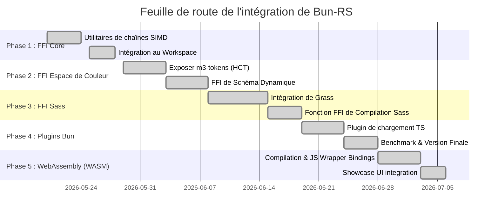

# Plan d'expansion et feuille de route de Bun-RS

Ce document décrit la feuille de route étape par étape pour étendre `bun-rs` en un outil d'aide à la compilation et un plugin d'utilitaires de thèmes complet pour le monorepo `material-web`.

---

## 📅 Aperçu de la feuille de route

---

## 🔍 Détails des phases

### 🟩 Phase 1 : Utilitaires de chaînes haute performance & SIMD (Terminé)

- **Objectif** : Établir la frontière FFI, tester la latence aller-retour et implémenter des fonctions de base à haute performance.
- **Livrables** :
  - [x] Configurer `bun-rs` comme un package de l'espace de travail (workspace) au sein de `material-web`.
  - [x] Implémenter le comptage de caractères SIMD et la recherche de sous-chaînes à l'aide de `memchr`.
  - [x] Construire des interfaces C-ABI conformes aux spécifications Rust 2024 (`#[unsafe(no_mangle)]`).
  - [x] Rédiger des benchmarks de vérification pour mesurer le surcoût (~1.5ns à 3ns de latence d'appel).

### 🟩 Phase 2 : FFI native de l'espace colorimétrique Material Design 3 (Terminé)

- **Objectif** : Remplacer le package JS `@material/material-color-utilities` par la bibliothèque native Rust `m3-tokens`.
- **Tâches** :
  - [x] Ajouter une dépendance par chemin/git vers la crate `m3-tokens` (située dans `/home/ubuntu/aphrody/crates/m3-tokens`) dans `/home/ubuntu/material-web/packages/bun-rs/Cargo.toml`.
  - [x] Implémenter les fonctions C-ABI pour effectuer :
    - Les conversions HCT vers RGB / Hex (`bun_rs_hct_to_argb`, `bun_rs_argb_to_hct`).
    - La génération de palettes de tons (générer 13 tons pour une teinte/chroma donnée via `bun_rs_hct_tones`).
    - La dérivation complète de schémas dynamiques (génération des 49 couleurs pour les modes clair/sombre via `bun_rs_derive_scheme`).
  - [x] Mapper les entrées/sorties JS via des pointeurs (`*const u8` pour les chaînes Hex, buffers de tableaux pour les palettes).
  - [x] Écrire des wrappers TypeScript FFI pour exposer ces couleurs dans une API Bun native.

### 🟩 Phase 3 : Compilateur Sass en Rust pur via FFI (Terminé)

- **Objectif** : Éliminer le processus Dart lent de `sass-embedded` et compiler les fichiers Sass entièrement en interne dans le processus à l'aide de Rust.
- **Tâches** :
  - [x] Ajouter la crate `grass` (compilateur Sass en Rust pur) aux dépendances de `bun-rs`.
  - [x] Exposer des fonctions thread-safe `bun_rs_compile_sass` et `bun_rs_compile_sass_file` avec support pour les options `load_paths` (chaîne délimitée par des points-virgules), `style` (OutputStyle Expanded/Compressed), et `quiet` (sourdine pour les avertissements).
  - [x] Implémenter la gestion des erreurs côté Rust (renvoyer des journaux d'erreurs et des chaînes d'erreur formatées via un paramètre de pointeur booléen `error_occurred` sans faire planter le processus).
  - [x] Implémenter des fonctions de libération de mémoire (`bun_rs_free_string`) pour éviter les fuites de mémoire des résultats de compilation alloués par Rust.
  - [x] Sécuriser le processus Bun contre les paniques Rust lors de la compilation Sass en enveloppant `grass::Options` avec `std::panic::AssertUnwindSafe` dans un bloc `catch_unwind`.

### 🟩 Phase 4 : Plugins de compilateur Bun (Terminé)

- **Objectif** : Construire des plugins de compilateur Bun qui interceptent les importations de fichiers `.scss` et `.css` et les résolvent de manière dynamique.
- **Tâches** :
  - [x] Écrire un plugin de build TS (`sass-plugin.ts` / `sassRustPlugin` dans `src/index.ts`) en utilisant l'API de plugin de Bun, supportant les options `loadPaths` et `style`.
  - [x] Intégrer ce plugin dans l'exemple `showcase` et dans le pipeline principal de bundling de `@material/web` (`aphrody-build.ts` et `test/sass-plugin.test.ts`).
  - [x] Écrire un script de benchmark (`packages/bun-rs/benchmark-sass.js`) pour comparer la vitesse de compilation de Grass FFI par rapport à `sass-embedded` et mesurer les gains de performance.
  - [x] Valider l'intégration via le typecheck TS et la suite de tests bxc Chromium réelle.

### 🟩 Phase 5 : WebAssembly (WASM) & Integration clientside (Terminé)

- **Objectif** : Compiler et partager le code Rust de génération de schémas de couleurs et de validation directement avec le navigateur de l'utilisateur.
- **Tâches** :
  - [x] Ajouter le package `wasm-bindgen` à la configuration de la crate `bun-rs`.
  - [x] Exposer des wrappers `#[wasm_bindgen]` pour toutes les fonctions d'espace de couleurs (`wasm_argb_to_hct`, `wasm_hct_to_argb`, `wasm_hct_tones`, `wasm_derive_scheme`).
  - [x] Compiler le package WASM à l'aide de `wasm-pack build --target web`.
  - [x] Exposer des cas d'usage à haute valeur ajoutée comme la validation clientside de code M3 (`wasm_validate_spec`) et la compilation Sass en ligne (`wasm_compile_sass`).
  - [x] Créer un tableau de bord et benchmark interactif dans la galerie React Showcase (`WasmSection.tsx`).
  - [x] Configurer la distribution et le typage du bundle WASM dans le serveur Bun local et les tests de fumée (smoke tests) d'intégration.
