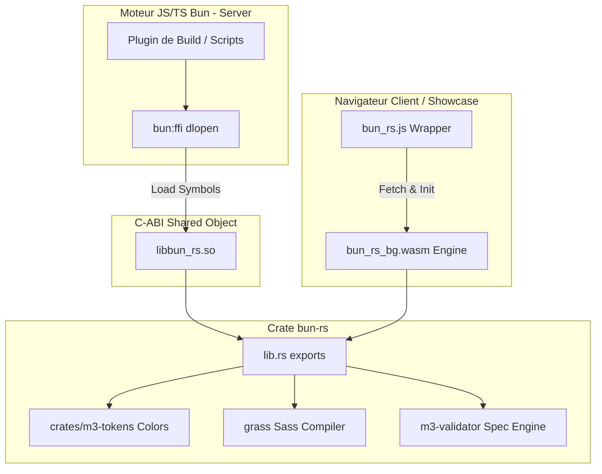

# Bun-RS — FFI natif haute performance pour material-web

`bun-rs` est un plugin natif Rust léger conçu pour **material-web** utilisant l'interface de fonction étrangère sans surcoût de Bun (`bun:ffi`). Il permet d'exécuter des opérations système critiques, la compilation Sass et les utilitaires de couleur Material Design à vitesse native directement au sein des applications Bun, sans surcharge de sous-processus.

---

## 🏗️ Architecture

`bun-rs` utilise une architecture hybride double face :

1.  **FFI Native (Serveur/Build)** : Relie le runtime Bun aux binaires natifs (`.so`, `.dll`, `.dylib`) via des wrappers C-ABI (`bun:ffi`) pour les tâches locales rapides (compilation Sass en plugin de build, peluchage de spécifications).
2.  **WebAssembly (Navigateur/Client)** : Compile le même code Rust source exact en WASM (`wasm32-unknown-unknown`) via `wasm-pack` pour une exécution ultra-rapide côté client sans dépendance FFI.



---

## ⚡ Proposition de valeur

Au sein de `material-web`, nous avons historiquement rencontré des goulots d'étranglement de performance et des problèmes de dépendance :

1. **Compilation Sass** : `sass-embedded` nécessite de lancer un processus Dart VM et de communiquer via protobuf/IPC. Cela entraîne une latence de démarrage du processus (~15ms par appel) et des tailles de packaging importantes.
2. **Utilitaires de couleur Material (MCU)** : Le package JS `@material/material-color-utilities` présente des problèmes de compatibilité ESM/CommonJS, nécessite des correctifs de bundler et exécute des conversions d'espace colorimétrique HCT gourmandes en CPU dans du JS interprété.
3. **Extraction de chaînes/tokens** : L'analyse des fichiers de mise en page ou le traitement des spécifications de conception multilignes nécessitent des balayages rapides de chaînes.

`bun-rs` résout ces problèmes en exposant :

- Un moteur de compilation Sass en Rust pur (`grass`) lié via FFI.
- Un générateur rapide de schémas et palettes de tons Material You (`crates/m3-tokens`) compilé nativement.
- Des fonctions utilitaires de chaînes de caractères accélérées par SIMD (`memchr`) à haute performance.

---

## 🚀 Démarrage rapide

### 1. Compiler la bibliothèque partagée

Générez le binaire de version (release) de la crate `bun-rs` :

```bash
bun run build
```

Cela produit la bibliothèque dynamique sous `packages/bun-rs/target/release/libbun_rs.so` (ou `.dylib` / `.dll`).

### 2. Compiler en WebAssembly (WASM) pour le navigateur

Compilez le package WASM à l'aide de `wasm-pack` :

```bash
cd packages/bun-rs && wasm-pack build --target web
```

Cela génère le package prêt à l'emploi (contenant `bun_rs_bg.wasm` et les wrappers JS/TS) sous `packages/bun-rs/pkg/`.

### 3. Lancer les benchmarks

Vérifiez les performances aller-retour du FFI par rapport au JS pur :

```bash
# Benchmark général d'appels FFI de base
bun run packages/bun-rs/benchmark.ts

# Benchmark spécifique de compilation Sass (Grass FFI vs Dart Sass)
bun run packages/bun-rs/benchmark-sass.ts
```

### 4. Exécuter les tests unitaires et d'intégration

Lancez la suite de tests côté Rust :

```bash
cargo test -p bun-rs
```

Pour tester le chargement client et serveur de l'application de prévisualisation :

```bash
bun run --filter=@aphrody/m3-showcase smoke
```
