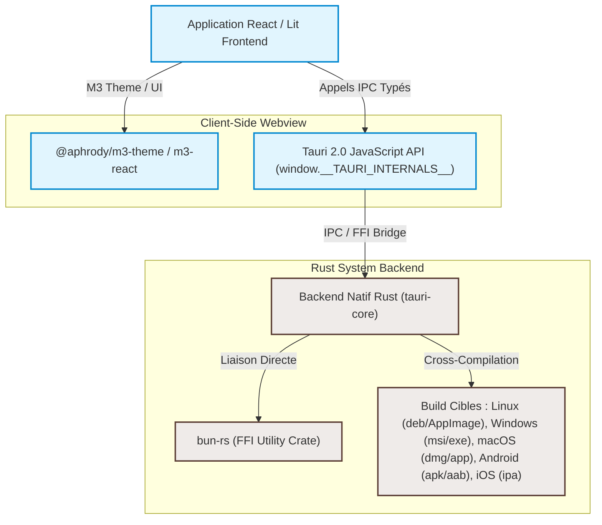

<!-- SPDX-License-Identifier: Apache-2.0 -->

# Guide d'Intégration Tauri 2.0 Cross-Platform & Monorepo Bun

Ce dossier fournit le guide de référence complet pour configurer, développer et empaqueter notre monorepo `material-web` (Lit components + React wrappers + Dynamic M3 Theme) avec **Tauri 2.0** et **Bun** sur les 5 plateformes majeures : **Windows**, **macOS**, **Linux**, **Android**, et **iOS**.

---

## 📌 Sommaire du dossier `docs/tauri`

Le dossier est divisé en guides thématiques pour vous accompagner pas-à-pas :

1.  **[01-prerequisites.md](file:///home/ubuntu/material-web/docs/tauri/01-prerequisites.md)** : Prérequis et configuration de l'environnement de développement pour chaque système d'exploitation hôte (compilateurs, SDKs mobiles, chaînes d'outils Rust).
2.  **[02-project-setup.md](file:///home/ubuntu/material-web/docs/tauri/02-project-setup.md)** : Initialisation de Tauri 2.0 dans le monorepo Bun, configuration du cycle de vie (dev server, build pipeline) et intégration de la FFI.
3.  **[03-desktop-platforms.md](file:///home/ubuntu/material-web/docs/tauri/03-desktop-platforms.md)** : Configuration et builds pour **Windows**, **macOS** et **Linux** (gestion des fenêtres frameless, styles M3, packaging).
4.  **[04-mobile-platforms.md](file:///home/ubuntu/material-web/docs/tauri/04-mobile-platforms.md)** : Configuration et développement pour **Android** (SDK, émulateur, gradle) et **iOS** (Xcode, simulateur, provisioning).
5.  **[05-type-safety-rust-ts.md](file:///home/ubuntu/material-web/docs/tauri/05-type-safety-rust-ts.md)** : Guide d'automatisation de la synchronisation des types de données Rust ↔ React en exploitant notre outil `ts-rs` intégré dans le workspace.

---

## 🏗️ Architecture du Système

---

## ⚡ Principes Directeurs de notre Intégration

*   **Bun-native par conception** : Bun sert de moteur d'exécution et de bundler frontend ultra-rapide (`Bun.build` / `Bun.serve`) sous Tauri, remplaçant avantageusement Vite ou Webpack.
*   **Performance native via Rust FFI** : Les calculs lourds (génération de schémas colorimétriques HCT, traitement de données) sont exécutés dans les couches Rust de Tauri ou dans notre FFI `bun-rs`, optimisant la consommation de batterie et de processeur, particulièrement sur mobile.
*   **Respect strict du design Material Design 3** : L'utilisation de fenêtres sans bordure (frameless) permet d'intégrer des composants d'interface M3 système (barres d'application, feuilles inférieures, dialogues et fenêtres d'arrière-plan translucides) en remplacement des bordures et décorations d'écran natives de l'OS.
